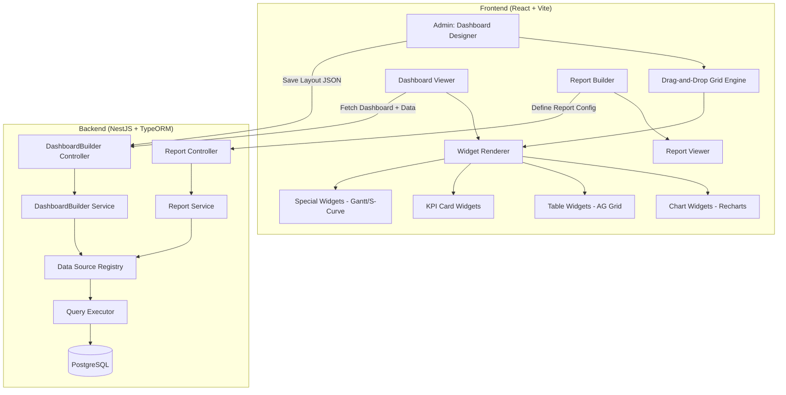
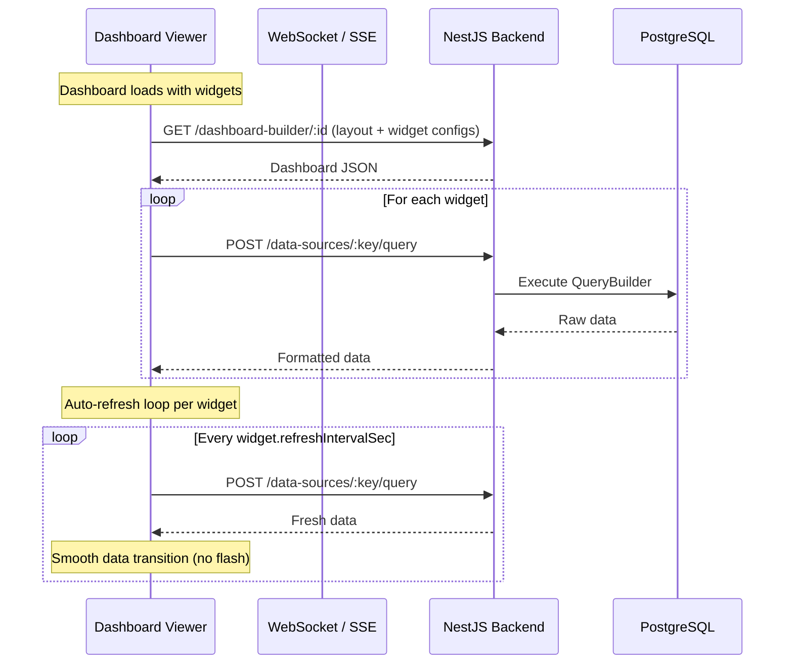

# 🏗️ SETU — Custom Dashboard & Report Builder
## Implementation Plan v1.0

> **Scope:** Admin-configurable dashboard builder + custom report engine with drag-and-drop layout, role-based assignment, real-time refresh, and template gallery.
> **Inspiration:** Salesforce Lightning Dashboard Builder, Metabase, Apache Superset

---

## 📐 Architecture Overview



---

## 📊 Data Source Registry (Core Engine)

The **Data Source Registry** is the heart of this module. It defines **what data is available** for widgets, using a safe, pre-defined approach (no raw SQL from users).

### Registry Pattern

Each data source is a registered TypeScript class that:
1. Has a **unique key** (e.g., `activity.progress`, `labor.daily`, `boq.burn`)
2. Exposes **available fields** (columns) with types and labels
3. Exposes **available filters** (project, date range, WBS node, etc.)
4. Exposes **supported aggregations** (SUM, COUNT, AVG, GROUP BY)
5. Has a **scope** flag: `PROJECT` | `GLOBAL` | `BOTH`
6. Executes the query via TypeORM QueryBuilder (safe, parameterized)

### Initial Data Sources (from existing SETU modules)

| Key | Module | Scope | Description | Available Fields |
|-----|--------|-------|-------------|-----------------|
| `activity.list` | WBS/Planning | PROJECT | All activities in a project | activityCode, activityName, status, percentComplete, startDatePlanned, finishDatePlanned, startDateActual, finishDateActual, duration, totalFloat, isCritical |
| `activity.delays` | Planning | BOTH | Delayed activities | activity fields + delayDays, isOverdue |
| `boq.items` | BOQ | PROJECT | Bill of Quantities | itemCode, description, unit, quantity, rate, amount |
| `boq.burn` | Progress | PROJECT | Cost burn over time | date, executedQty, rate, burnValue |
| `labor.daily` | Labor | PROJECT | Daily manpower count | date, category, count, projectId |
| `labor.trend` | Labor | BOTH | Manpower trend (aggregated) | date, totalCount, avgCount |
| `ehs.incidents` | EHS | PROJECT | Safety incidents | date, type, severity, location, status |
| `ehs.inspections` | EHS | PROJECT | Safety inspections | date, score, inspector, status |
| `ehs.training` | EHS | BOTH | Training records | date, topic, attendees, projectId |
| `quality.observations` | Quality | PROJECT | Site observations | date, type, status, location, severity |
| `quality.inspections` | Quality | PROJECT | Inspection requests | date, status, requestedBy, activity |
| `quality.ratings` | Quality | PROJECT | Quality ratings | location, weightedScore, totalScore |
| `schedule.versions` | Planning | PROJECT | Schedule versions / revisions | versionCode, type, createdOn, sequenceNumber |
| `schedule.variance` | Planning | PROJECT | Baseline vs Revised variance | activityName, startVariance, finishVariance |
| `progress.daily` | Progress | BOTH | Daily progress measurements | date, activity, measuredQty, percentComplete |
| `project.portfolio` | EPS | GLOBAL | All projects overview | projectName, status, startDate, endDate, projectCode |
| `micro.schedule` | Micro-Schedule | PROJECT | Micro-schedule activities | date, activity, trade, location, status |
| `design.drawings` | Design | PROJECT | Drawing register | drawingNo, title, revision, status, discipline |
| `workorder.summary` | Contracts | PROJECT | Work order summary | vendorName, workType, totalValue, status |

> [!IMPORTANT]
> **Extensibility:** When a new module is created, a developer simply creates a new DataSource class implementing `IDataSource` and registers it. The dashboard builder auto-discovers it.

---

## 🗄️ Database Schema (8 New Tables)

### Entity Relationship Diagram

```mermaid
erDiagram
    CUSTOM_DASHBOARD {
        int id PK
        string name
        string description
        enum scope "PROJECT | GLOBAL"
        int projectId FK "nullable, for PROJECT-scoped"
        json layoutConfig "grid positions, sizes"
        boolean isTemplate
        boolean isDefault
        int createdById FK
        timestamp createdAt
        timestamp updatedAt
        boolean isActive
    }

    DASHBOARD_WIDGET {
        int id PK
        int dashboardId FK
        string widgetType "KPI | BAR | LINE | PIE | DONUT | TABLE | AREA | SCATTER | GAUGE | GANTT | SCURVE | HEATMAP | FUNNEL | RADAR | STACKED_BAR | TREEMAP | COUNTER | PROGRESS_RING | TIMELINE | MAP"
        string title
        string dataSourceKey "registry key"
        json queryConfig "filters, groupBy, orderBy, limit"
        json displayConfig "colors, labels, axes, formatting"
        json gridPosition "x, y, w, h in grid units"
        int refreshIntervalSec "0 = manual only"
        int sortOrder
    }

    DASHBOARD_ASSIGNMENT {
        int id PK
        int dashboardId FK
        enum assignmentType "ROLE | USER | DEFAULT_GLOBAL | DEFAULT_PROJECT"
        int roleId FK "nullable"
        int userId FK "nullable"
        int projectId FK "nullable, for project-scoped defaults"
        int priority "for ordering when multiple dashboards assigned"
    }

    DASHBOARD_TEMPLATE {
        int id PK
        string name
        string category "Construction | Finance | Safety | Quality | Custom"
        string description
        string thumbnailUrl
        json layoutConfig
        json widgetsConfig "array of widget definitions"
        boolean isSystemTemplate "system-provided vs user-created"
        int createdById FK
    }

    CUSTOM_REPORT {
        int id PK
        string name
        string description
        enum reportType "TABULAR | VISUAL | MATRIX | SUMMARY"
        string dataSourceKey
        json columns "selected fields with labels"
        json filters "applied filters"
        json groupBy "grouping config"
        json sorting "sort config"
        json formatting "conditional formatting rules"
        json chartConfig "for VISUAL type"
        int createdById FK
        boolean isShared
        timestamp createdAt
        timestamp updatedAt
    }

    REPORT_SCHEDULE {
        int id PK
        int reportId FK
        enum frequency "DAILY | WEEKLY | MONTHLY"
        string cronExpression
        enum format "PDF | EXCEL | CSV"
        json recipients "array of email/userId"
        boolean isActive
        timestamp lastRunAt
        timestamp nextRunAt
    }

    DATA_SOURCE_REGISTRY {
        int id PK
        string key UK
        string label
        string module
        string description
        enum scope "PROJECT | GLOBAL | BOTH"
        json availableFields
        json availableFilters
        json supportedAggregations
        boolean isActive
        int sortOrder
    }

    DASHBOARD_SHARE_LOG {
        int id PK
        int dashboardId FK
        int sharedById FK
        int sharedWithUserId FK
        timestamp sharedAt
        enum accessLevel "VIEW | EDIT"
    }

    CUSTOM_DASHBOARD ||--o{ DASHBOARD_WIDGET : "has many"
    CUSTOM_DASHBOARD ||--o{ DASHBOARD_ASSIGNMENT : "assigned to"
    CUSTOM_REPORT ||--o| REPORT_SCHEDULE : "has schedule"
    CUSTOM_DASHBOARD ||--o{ DASHBOARD_SHARE_LOG : "shared with"
```



---

## 🔧 Backend Implementation

### File Structure

```
backend/src/dashboard-builder/
├── dashboard-builder.module.ts
├── dashboard-builder.controller.ts
├── dashboard-builder.service.ts
├── report.controller.ts
├── report.service.ts
├── query-executor.service.ts
├── data-source-registry.service.ts
├── dto/
│   ├── create-dashboard.dto.ts
│   ├── update-dashboard.dto.ts
│   ├── create-widget.dto.ts
│   ├── create-report.dto.ts
│   ├── query-data.dto.ts
│   └── schedule-report.dto.ts
├── entities/
│   ├── custom-dashboard.entity.ts
│   ├── dashboard-widget.entity.ts
│   ├── dashboard-assignment.entity.ts
│   ├── dashboard-template.entity.ts
│   ├── custom-report.entity.ts
│   ├── report-schedule.entity.ts
│   ├── data-source-meta.entity.ts
│   └── dashboard-share-log.entity.ts
└── data-sources/
    ├── base.data-source.ts          # IDataSource interface
    ├── activity-list.source.ts
    ├── activity-delays.source.ts
    ├── boq-items.source.ts
    ├── boq-burn.source.ts
    ├── labor-daily.source.ts
    ├── ehs-incidents.source.ts
    ├── quality-observations.source.ts
    ├── progress-daily.source.ts
    ├── project-portfolio.source.ts
    ├── schedule-variance.source.ts
    └── index.ts                     # Auto-registration barrel
```

### API Endpoints

| Method | Path | Permission | Description |
|--------|------|------------|-------------|
| **Dashboards** |
| `POST` | `/dashboard-builder` | `ADMIN.DASHBOARD.CREATE` | Create new dashboard |
| `GET` | `/dashboard-builder` | `ADMIN.DASHBOARD.READ` | List all dashboards (admin) |
| `GET` | `/dashboard-builder/my` | *(authenticated)* | Get dashboards assigned to current user's role |
| `GET` | `/dashboard-builder/:id` | `ADMIN.DASHBOARD.READ` | Get single dashboard with widgets |
| `PATCH` | `/dashboard-builder/:id` | `ADMIN.DASHBOARD.UPDATE` | Update dashboard (layout, name, etc.) |
| `DELETE` | `/dashboard-builder/:id` | `ADMIN.DASHBOARD.DELETE` | Delete dashboard |
| `POST` | `/dashboard-builder/:id/clone` | `ADMIN.DASHBOARD.CREATE` | Clone dashboard |
| **Widgets** |
| `POST` | `/dashboard-builder/:id/widgets` | `ADMIN.DASHBOARD.UPDATE` | Add widget to dashboard |
| `PATCH` | `/dashboard-builder/widgets/:widgetId` | `ADMIN.DASHBOARD.UPDATE` | Update widget config |
| `DELETE` | `/dashboard-builder/widgets/:widgetId` | `ADMIN.DASHBOARD.DELETE` | Remove widget |
| **Data** |
| `GET` | `/dashboard-builder/data-sources` | `ADMIN.DASHBOARD.READ` | List all available data sources |
| `POST` | `/dashboard-builder/data-sources/:key/query` | *(authenticated)* | Execute data query (returns chart/table data) |
| `POST` | `/dashboard-builder/data-sources/:key/preview` | `ADMIN.DASHBOARD.READ` | Preview query results while building |
| **Assignments** |
| `POST` | `/dashboard-builder/:id/assign` | `ADMIN.DASHBOARD.UPDATE` | Assign dashboard to role/user |
| `DELETE` | `/dashboard-builder/:id/assign/:assignmentId` | `ADMIN.DASHBOARD.UPDATE` | Remove assignment |
| `GET` | `/dashboard-builder/defaults` | *(authenticated)* | Get default dashboard for current user |
| **Templates** |
| `GET` | `/dashboard-builder/templates` | `ADMIN.DASHBOARD.READ` | List template gallery |
| `POST` | `/dashboard-builder/templates/:templateId/apply` | `ADMIN.DASHBOARD.CREATE` | Create dashboard from template |
| `POST` | `/dashboard-builder/:id/save-as-template` | `ADMIN.DASHBOARD.CREATE` | Save dashboard as template |
| **Reports** |
| `POST` | `/reports` | `ADMIN.REPORT.CREATE` | Create custom report |
| `GET` | `/reports` | `ADMIN.REPORT.READ` | List reports |
| `GET` | `/reports/:id` | `ADMIN.REPORT.READ` | Get report config |
| `POST` | `/reports/:id/execute` | *(authenticated)* | Run report and return data |
| `POST` | `/reports/:id/export` | *(authenticated)* | Export as PDF/Excel/CSV |
| `POST` | `/reports/:id/schedule` | `ADMIN.REPORT.MANAGE` | Schedule report |

### IDataSource Interface

```typescript
// backend/src/dashboard-builder/data-sources/base.data-source.ts

export interface DataSourceField {
  key: string;           // e.g. 'activityName'
  label: string;         // e.g. 'Activity Name'
  type: 'string' | 'number' | 'date' | 'boolean' | 'percent';
  aggregatable?: boolean; // Can this field be SUM/AVG/COUNT?
  groupable?: boolean;    // Can this field be used in GROUP BY?
  filterable?: boolean;
}

export interface DataSourceFilter {
  key: string;
  label: string;
  type: 'select' | 'date_range' | 'number_range' | 'text' | 'multi_select';
  options?: { value: string; label: string }[]; // For select types
  required?: boolean;
}

export interface QueryConfig {
  filters?: Record<string, any>;
  groupBy?: string[];
  aggregations?: { field: string; fn: 'SUM' | 'COUNT' | 'AVG' | 'MIN' | 'MAX' }[];
  orderBy?: { field: string; direction: 'ASC' | 'DESC' }[];
  limit?: number;
  projectId?: number;
  dateRange?: { start: Date; end: Date };
}

export interface IDataSource {
  key: string;
  label: string;
  module: string;
  scope: 'PROJECT' | 'GLOBAL' | 'BOTH';
  fields: DataSourceField[];
  filters: DataSourceFilter[];
  
  execute(config: QueryConfig): Promise<any[]>;
  count(config: QueryConfig): Promise<number>;
}
```

### Example Data Source Implementation

```typescript
// backend/src/dashboard-builder/data-sources/activity-delays.source.ts

@Injectable()
export class ActivityDelaysSource implements IDataSource {
  key = 'activity.delays';
  label = 'Delayed Activities';
  module = 'Planning';
  scope = 'BOTH' as const;

  fields: DataSourceField[] = [
    { key: 'activityCode', label: 'Activity Code', type: 'string', groupable: true },
    { key: 'activityName', label: 'Activity Name', type: 'string' },
    { key: 'projectName', label: 'Project', type: 'string', groupable: true },
    { key: 'finishDatePlanned', label: 'Planned Finish', type: 'date' },
    { key: 'delayDays', label: 'Delay (Days)', type: 'number', aggregatable: true },
    { key: 'percentComplete', label: '% Complete', type: 'percent' },
    { key: 'status', label: 'Status', type: 'string', groupable: true, filterable: true },
    { key: 'wbsCode', label: 'WBS Code', type: 'string', groupable: true },
  ];

  filters: DataSourceFilter[] = [
    { key: 'projectId', label: 'Project', type: 'select', required: false },
    { key: 'minDelay', label: 'Min Delay Days', type: 'number_range' },
    { key: 'status', label: 'Status', type: 'multi_select', options: [...] },
  ];

  constructor(
    @InjectRepository(Activity) private activityRepo: Repository<Activity>,
  ) {}

  async execute(config: QueryConfig): Promise<any[]> {
    const qb = this.activityRepo.createQueryBuilder('a')
      .leftJoin('a.wbsNode', 'w')
      .leftJoin('w.project', 'p')
      .where('a.finishDatePlanned < NOW()')
      .andWhere('a.finishDateActual IS NULL')
      .andWhere('a.percentComplete < 100');

    if (config.projectId) {
      qb.andWhere('a.projectId = :pid', { pid: config.projectId });
    }

    qb.select([
      'a.activityCode AS "activityCode"',
      'a.activityName AS "activityName"',
      'p.name AS "projectName"',
      'a.finishDatePlanned AS "finishDatePlanned"',
      'EXTRACT(DAY FROM NOW() - a.finishDatePlanned) AS "delayDays"',
      'a.percentComplete AS "percentComplete"',
      'a.status AS "status"',
      'w.wbsCode AS "wbsCode"',
    ]);

    // Apply dynamic aggregations, groupBy, orderBy from config...
    return qb.getRawMany();
  }
}
```

---

## 🎨 Frontend Implementation

### File Structure

```
frontend/src/
├── views/
│   └── dashboard-builder/
│       ├── DashboardBuilderHome.tsx       # Admin: list of all dashboards
│       ├── DashboardDesigner.tsx          # Admin: drag-and-drop editor
│       ├── DashboardViewer.tsx            # User: rendered dashboard view
│       ├── TemplateGallery.tsx            # Template browser with previews
│       ├── DataSourcePicker.tsx           # Modal to pick data source + fields
│       ├── WidgetConfigurator.tsx         # Configure widget filters/display
│       ├── ReportBuilder.tsx             # Report creation wizard
│       ├── ReportViewer.tsx              # Rendered report
│       ├── AssignmentManager.tsx         # Assign dashboards to roles
│       └── components/
│           ├── GridLayout.tsx             # react-grid-layout wrapper
│           ├── WidgetCard.tsx             # Container for each widget
│           ├── widgets/
│           │   ├── KpiCardWidget.tsx
│           │   ├── BarChartWidget.tsx
│           │   ├── LineChartWidget.tsx
│           │   ├── PieChartWidget.tsx
│           │   ├── DonutChartWidget.tsx
│           │   ├── AreaChartWidget.tsx
│           │   ├── TableWidget.tsx        # AG Grid
│           │   ├── GaugeWidget.tsx
│           │   ├── ProgressRingWidget.tsx
│           │   ├── CounterWidget.tsx
│           │   ├── ScatterWidget.tsx
│           │   ├── HeatmapWidget.tsx
│           │   ├── StackedBarWidget.tsx
│           │   ├── TreemapWidget.tsx
│           │   ├── RadarWidget.tsx
│           │   ├── FunnelWidget.tsx
│           │   ├── TimelineWidget.tsx
│           │   ├── SCurveWidget.tsx
│           │   └── GanttSnippetWidget.tsx
│           ├── filters/
│           │   ├── DateRangeFilter.tsx
│           │   ├── ProjectFilter.tsx
│           │   ├── MultiSelectFilter.tsx
│           │   └── NumberRangeFilter.tsx
│           └── preview/
│               └── WidgetPreview.tsx      # Live preview in configurator
```

### Widget Catalog (20 Types)

| # | Widget Type | Library | Best For |
|---|------------|---------|----------|
| 1 | **KPI Card** | Custom | Single metric with trend arrow |
| 2 | **Counter** | Custom | Animated number counter |
| 3 | **Progress Ring** | Custom SVG | Percentage completion |
| 4 | **Bar Chart** | Recharts | Category comparisons |
| 5 | **Stacked Bar** | Recharts | Multi-series comparisons |
| 6 | **Line Chart** | Recharts | Trends over time |
| 7 | **Area Chart** | Recharts | Volume trends |
| 8 | **Pie Chart** | Recharts | Distribution |
| 9 | **Donut Chart** | Recharts | Distribution with center stat |
| 10 | **Scatter Plot** | Recharts | Correlation analysis |
| 11 | **Radar Chart** | Recharts | Multi-metric comparison |
| 12 | **Treemap** | Recharts | Hierarchical data |
| 13 | **Funnel** | Recharts | Pipeline/stages |
| 14 | **Heatmap** | Custom + D3 | Matrix data (dates × categories) |
| 15 | **Gauge** | Custom SVG | Single value against target |
| 16 | **Data Table** | AG Grid | Tabular data with sorting/filter |
| 17 | **Timeline** | Custom | Event sequences |
| 18 | **S-Curve** | Recharts | Planned vs Actual cumulative |
| 19 | **Gantt Snippet** | Custom | Top-N activities schedule bars |
| 20 | **Map/Location** | Reserved | For future GIS visualization |

### Drag-and-Drop Grid Engine

**Library:** `react-grid-layout` (most mature, ~3.4M weekly downloads)

```typescript
// Grid Configuration
const GRID_CONFIG = {
  cols: 12,           // 12-column grid (like Bootstrap)
  rowHeight: 80,      // Each row = 80px
  margin: [16, 16],   // Gap between widgets
  compactType: 'vertical',
  preventCollision: false,
  isResizable: true,   // In designer mode
  isDraggable: true,   // In designer mode
};

// Widget default sizes by type
const WIDGET_DEFAULTS: Record<string, { w: number; h: number; minW: number; minH: number }> = {
  KPI:           { w: 3, h: 2, minW: 2, minH: 2 },
  COUNTER:       { w: 2, h: 2, minW: 2, minH: 2 },
  PROGRESS_RING: { w: 2, h: 3, minW: 2, minH: 2 },
  BAR:           { w: 6, h: 4, minW: 3, minH: 3 },
  STACKED_BAR:   { w: 6, h: 4, minW: 3, minH: 3 },
  LINE:          { w: 8, h: 4, minW: 4, minH: 3 },
  AREA:          { w: 8, h: 4, minW: 4, minH: 3 },
  PIE:           { w: 4, h: 4, minW: 3, minH: 3 },
  DONUT:         { w: 4, h: 4, minW: 3, minH: 3 },
  TABLE:         { w: 12, h: 5, minW: 6, minH: 3 },
  GAUGE:         { w: 3, h: 3, minW: 2, minH: 2 },
  SCURVE:        { w: 12, h: 5, minW: 6, minH: 4 },
  GANTT:         { w: 12, h: 5, minW: 8, minH: 4 },
  HEATMAP:       { w: 6, h: 4, minW: 4, minH: 3 },
  SCATTER:       { w: 6, h: 4, minW: 4, minH: 3 },
  RADAR:         { w: 4, h: 4, minW: 3, minH: 3 },
  TREEMAP:       { w: 6, h: 4, minW: 4, minH: 3 },
  FUNNEL:        { w: 4, h: 5, minW: 3, minH: 3 },
  TIMELINE:      { w: 12, h: 4, minW: 8, minH: 3 },
};
```

---

## 🔄 Real-Time Refresh Architecture



**Implementation:** Each widget manages its own `setInterval` based on `refreshIntervalSec`. The viewer uses a `useEffect` cleanup to prevent memory leaks. When a widget's interval fires, it fetches fresh data and performs a smooth React state transition (no full re-render).

---

## 🚀 Phased Delivery Roadmap

### Phase 1: Foundation (Backend Core)
**Estimated Effort: 3-4 days**

| Task | File(s) | Details |
|------|---------|---------|
| 1.1 | Create entities | 8 TypeORM entities in `dashboard-builder/entities/` |
| 1.2 | Create module, controller, service | Basic CRUD for dashboards |
| 1.3 | Implement Data Source Registry | `IDataSource` interface + registration pattern |
| 1.4 | Build 5 core data sources | `activity.list`, `boq.burn`, `labor.daily`, `project.portfolio`, `progress.daily` |
| 1.5 | Query Executor service | Safe parameterized query execution with filters/aggregations |
| 1.6 | Register in `app.module.ts` | Add all entities and module |
| 1.7 | Add permissions | `ADMIN.DASHBOARD.CREATE/READ/UPDATE/DELETE`, `ADMIN.REPORT.CREATE/READ/MANAGE` |

**Verification:** API returns data sources list and executes test queries

---

### Phase 2: Dashboard Designer (Frontend Admin)
**Estimated Effort: 4-5 days**

| Task | File(s) | Details |
|------|---------|---------|
| 2.1 | Install `react-grid-layout` | `npm install react-grid-layout @types/react-grid-layout` |
| 2.2 | Build `DashboardDesigner.tsx` | Drag-drop grid with widget placeholders |
| 2.3 | Build `DataSourcePicker.tsx` | Modal: pick source → pick fields → pick chart type |
| 2.4 | Build `WidgetConfigurator.tsx` | Right panel: filters, colors, labels, refresh interval |
| 2.5 | Build 10 core widgets | KPI, Counter, Bar, Line, Pie, Donut, Area, Table, Gauge, ProgressRing |
| 2.6 | Save/Load layout | JSON serialization of grid positions + widget configs |
| 2.7 | Add route + sidebar menu | `Admin > Dashboard Builder` in sidebar |
| 2.8 | Live preview in configurator | Real-time data preview as user configures |

**Verification:** Admin can create a dashboard, add widgets, configure data, drag/resize, and save

---

### Phase 3: Dashboard Viewer + Assignment
**Estimated Effort: 2-3 days**

| Task | File(s) | Details |
|------|---------|---------|
| 3.1 | Build `DashboardViewer.tsx` | Read-only rendered dashboard |
| 3.2 | Build `AssignmentManager.tsx` | Assign dashboards to roles/users |
| 3.3 | Implement "Default Dashboard" | Replace/augment `ManagementDashboard.tsx` with assigned dashboard |
| 3.4 | Real-time refresh | Per-widget auto-refresh based on `refreshIntervalSec` |
| 3.5 | Dashboard sharing | Share with specific users via share log |
| 3.6 | Project-scoped dashboards | Filter data by active project context |

**Verification:** Users see their assigned dashboard when logged in; auto-refresh works

---

### Phase 4: Advanced Widgets + More Data Sources
**Estimated Effort: 3-4 days**

| Task | File(s) | Details |
|------|---------|---------|
| 4.1 | Build remaining 10 widgets | Scatter, Radar, Treemap, Funnel, Heatmap, StackedBar, Timeline, SCurve, Gantt, Counter |
| 4.2 | Build remaining data sources | EHS, Quality, Schedule Variance, Design, Workorder, Micro-schedule |
| 4.3 | Widget conditional formatting | Color thresholds (red/amber/green) |
| 4.4 | Widget drill-down | Click widget → navigate to detail/filtered view |

**Verification:** All 20 widget types render correctly with all data sources

---

### Phase 5: Template Gallery
**Estimated Effort: 1-2 days**

| Task | File(s) | Details |
|------|---------|---------|
| 5.1 | Build `TemplateGallery.tsx` | Grid of template cards with thumbnails |
| 5.2 | System templates | Pre-build 5 templates (Construction Overview, Safety Dashboard, Quality Scorecard, Financial Summary, Project Portfolio) |
| 5.3 | "Save as Template" flow | Export dashboard config as template |
| 5.4 | "Apply Template" flow | Clone template into new dashboard |

**Verification:** Admin can browse templates, preview, and create dashboards from them

---

### Phase 6: Custom Report Builder
**Estimated Effort: 3-4 days**

| Task | File(s) | Details |
|------|---------|---------|
| 6.1 | Build `ReportBuilder.tsx` | Step wizard: Source → Fields → Filters → Grouping → Format |
| 6.2 | Tabular reports | AG Grid with column selection, sorting, grouping |
| 6.3 | Visual reports | Embed chart in report with selected data |
| 6.4 | Matrix reports | Cross-tab pivot table |
| 6.5 | Export (PDF/Excel/CSV) | Server-side generation via existing PDF tool |
| 6.6 | Report scheduling | Cron-based auto-run + email (future) |
| 6.7 | List reports page | Browse, run, export, share |

**Verification:** User can create a report, preview it, export to Excel/PDF

---

## 🔐 Permission Codes

| Code | Description |
|------|-------------|
| `ADMIN.DASHBOARD.CREATE` | Create custom dashboards |
| `ADMIN.DASHBOARD.READ` | View dashboard builder admin |
| `ADMIN.DASHBOARD.UPDATE` | Edit dashboards, manage widgets & assignments |
| `ADMIN.DASHBOARD.DELETE` | Delete dashboards |
| `ADMIN.REPORT.CREATE` | Create custom reports |
| `ADMIN.REPORT.READ` | View report builder admin |
| `ADMIN.REPORT.MANAGE` | Schedule reports, manage sharing |

---

## 📦 New NPM Dependencies

### Frontend
| Package | Purpose | Size |
|---------|---------|------|
| `react-grid-layout` | Drag-and-drop dashboard grid | ~50KB |
| `@types/react-grid-layout` | TypeScript types | Dev |
| `recharts` | ✅ Already installed | — |
| `ag-grid-react` | ✅ Already installed | — |

### Backend
| Package | Purpose |
|---------|---------|
| *(none new)* | TypeORM QueryBuilder handles all queries |

---

## 🗺️ Sidebar Menu Integration

```
Admin (dropdown)
├── User Management
├── Role Management
├── System Permissions
├── System Logs
├── Calendars
├── 🆕 Dashboard Builder     ← New
├── 🆕 Custom Reports        ← New
├── Vendor Access Templates
```

Route paths:
- `/dashboard/admin/dashboard-builder` — Dashboard Builder Home
- `/dashboard/admin/dashboard-builder/:id/edit` — Dashboard Designer
- `/dashboard/admin/dashboard-builder/templates` — Template Gallery
- `/dashboard/admin/reports` — Report Builder Home
- `/dashboard/admin/reports/:id` — Report Viewer

---

## 🎯 Key Design Decisions

| Decision | Choice | Rationale |
|----------|--------|-----------|
| **Query safety** | Pre-defined data sources, no raw SQL | Prevents SQL injection, ensures performance |
| **Grid library** | `react-grid-layout` | Most mature, Salesforce-like UX, small bundle |
| **Chart library** | Recharts (existing) | Already in project, good API, SSR-safe |
| **Data table** | AG Grid (existing) | Already in project, enterprise features |
| **Storage format** | JSON columns in PostgreSQL | Flexible, no schema migration per widget type |
| **Refresh strategy** | Per-widget `setInterval` | Granular control, no unnecessary refreshes |
| **Template system** | JSON snapshot of dashboard config | Simple, portable, version-safe |
| **Report export** | Leverage existing PDF tool (`setu_pdf_tool_dev`) | Re-use existing infrastructure |

---

## ✅ Pre-Implementation Checklist

- [ ] Confirm `react-grid-layout` compatible with current React version
- [ ] Review PostgreSQL JSON query performance for widget configs
- [ ] Verify all 18+ data source entities are available in TypeORM
- [ ] Confirm existing PDF tool supports generic report templates
- [ ] Plan database migration strategy for 8 new tables

---

> [!TIP]
> **Start with Phase 1 + Phase 2** to get a working prototype that the admin can demo.
> Phases 3-6 layer on viewer, templates, reports, and polish.

> [!NOTE]
> **Total Estimated Effort:** 16-22 days for full implementation across all 6 phases.
> **MVP (Phases 1-3):** 9-12 days for a functional dashboard builder with viewer.
