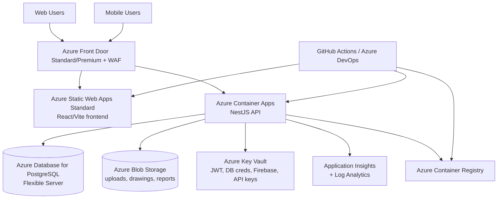

# SETU Azure Architecture One-Pager

## Scope

Target workload:

- 1,500 provisioned users
- 10 sustained API requests/second
- 20 to 30 requests/second short bursts
- Production deployment on Azure with room for horizontal scale

## Recommended Architecture

## Service Mapping

| Layer | Azure service | Why it fits SETU |
|---|---|---|
| Web entry | Azure Front Door Standard/Premium | Global HTTPS entry point, WAF, TLS, routing, CDN-style caching |
| Frontend | Azure Static Web Apps Standard | Best fit for React/Vite static assets and simple frontend deployment |
| API | Azure Container Apps | Good match for the existing containerized NestJS backend and scale-out pattern |
| Database | Azure Database for PostgreSQL Flexible Server | Native fit for the TypeORM/PostgreSQL backend |
| Object storage | Azure Blob Storage | Replaces local `/uploads` storage so files survive scaling and redeploys |
| Secrets | Azure Key Vault | Removes secrets from images and env files |
| Images | Azure Container Registry Standard | Stores production backend images |
| Monitoring | Azure Monitor, Application Insights, Log Analytics | Request tracing, errors, infra metrics, alerting |

## Runtime Sizing

### Baseline

- Frontend:
  - 1 Static Web Apps Standard instance
- Backend:
  - Azure Container Apps
  - min replicas: 2
  - max replicas: 8
  - per replica: 2 vCPU, 4 GiB RAM
  - autoscale target: HTTP concurrency 20
- Database:
  - PostgreSQL Flexible Server
  - General Purpose
  - 4 vCores, 16 GiB RAM
  - 256 GiB storage with autogrow
  - zone-redundant HA enabled
- Storage:
  - Blob Storage GPv2 Standard, Hot tier
  - 100 to 250 GiB starting capacity

### Scale Path

- First scale API from 2 to 4 replicas
- Then tune slow queries and indexes
- Then raise PostgreSQL to 8 vCores only if CPU, waits, or connections show sustained pressure

## Architecture Risks In Current Repo

These should be treated as pre-production blockers:

- Local file storage:
  - The backend serves `/uploads` from local disk in [backend/src/main.ts](C:/Users/omano/OneDrive%20-%20Puravankara%20Limited/Manoranjan/Antigravity%20Experiment/000%20Project%20PM/SETU/backend/src/main.ts#L84)
  - Static serving is also configured in [backend/src/app.module.ts](C:/Users/omano/OneDrive%20-%20Puravankara%20Limited/Manoranjan/Antigravity%20Experiment/000%20Project%20PM/SETU/backend/src/app.module.ts#L364)
- Secret baked into image:
  - `firebase-service-account.json` is copied into the production image in [Dockerfile](C:/Users/omano/OneDrive%20-%20Puravankara%20Limited/Manoranjan/Antigravity%20Experiment/000%20Project%20PM/SETU/Dockerfile#L21)
- No health endpoint yet:
  - [backend/src/app.controller.ts](C:/Users/omano/OneDrive%20-%20Puravankara%20Limited/Manoranjan/Antigravity%20Experiment/000%20Project%20PM/SETU/backend/src/app.controller.ts#L1) currently exposes `/hello`, not a production readiness/liveness endpoint

## Recommended Production SLO Targets

- API availability: 99.9%
- API p95 latency:
  - read endpoints: under 1000 ms
  - write endpoints: under 1500 ms
- API error rate: under 1%
- Database CPU:
  - normal steady state under 60%
  - alert at 75%

## Notes

- This design assumes frontend and backend are deployed separately in Azure even though the current Dockerfile can package them together.
- This is the cleaner long-term operating model for scale, rollback, and cost control.
