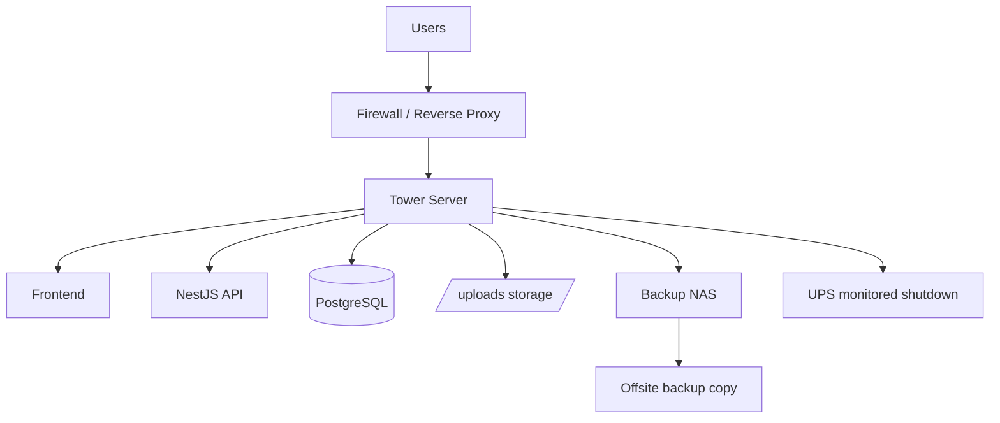

# SETU On-Prem BOM

## Purpose

This document describes a practical on-prem hosting bill of materials for SETU using a server-grade tower PC instead of Azure.

Target planning basis:

- 1,500 provisioned users
- 10 sustained API requests/second
- moderate internal or controlled external usage
- single-site deployment

This is a realistic small-business on-prem design, not a high-availability enterprise cluster.

## Reality Check

Yes, SETU can be self-hosted on a server-grade PC or tower server.

But this only makes sense if you accept:

- single-site risk
- your own internet uptime becomes production uptime
- your own power stability becomes production uptime
- you own backups, monitoring, patching, firewalling, and disaster recovery

It is best suited for:

- internal deployment
- one company / one office
- limited public exposure
- moderate SLA expectations

It is not the best fit if you need:

- strong external uptime guarantees
- multi-region resilience
- easy elastic scaling
- managed security/compliance posture

## Current Repo Constraints

These matter for on-prem too:

- the backend currently writes and serves files from local `/uploads` in [backend/src/main.ts](C:/Users/omano/OneDrive%20-%20Puravankara%20Limited/Manoranjan/Antigravity%20Experiment/000%20Project%20PM/SETU/backend/src/main.ts#L84)
- local static upload serving is also configured in [backend/src/app.module.ts](C:/Users/omano/OneDrive%20-%20Puravankara%20Limited/Manoranjan/Antigravity%20Experiment/000%20Project%20PM/SETU/backend/src/app.module.ts#L364)
- the production image currently copies `firebase-service-account.json` in [Dockerfile](C:/Users/omano/OneDrive%20-%20Puravankara%20Limited/Manoranjan/Antigravity%20Experiment/000%20Project%20PM/SETU/Dockerfile#L21)
- the latest load report still shows critical read-flow failures in [load-tests/k6/reports/20260328-191256/load-test-report.md](C:/Users/omano/OneDrive%20-%20Puravankara%20Limited/Manoranjan/Antigravity%20Experiment/000%20Project%20PM/SETU/load-tests/k6/reports/20260328-191256/load-test-report.md#L13)

So on-prem reduces cloud spend, but it does not remove app hardening work.

## Recommended Deployment Model

Recommended topology:

- 1 tower server for app + database
- 1 separate NAS or backup target for off-server backups
- 1 UPS
- 1 business-grade firewall/router
- 1 business internet connection with static public IP if external access is needed

## Hardware BOM

### Option A: Balanced Recommended Build

This is the best fit for SETU if you want serious but still cost-conscious on-prem hosting.

| Component | Recommended spec | Notes |
|---|---|---|
| Chassis / platform | Tower server such as Dell PowerEdge T360 or HPE ProLiant ML30 Gen11 | Current server-grade tower class |
| CPU | 6 to 8 performance cores, server-grade Xeon / Xeon E class | Enough for Docker, Node/NestJS, PostgreSQL, background jobs |
| RAM | 64 GB ECC | Recommended starting point |
| OS drives | 2 x 1 TB enterprise SSD or NVMe in RAID1 | OS, containers, logs |
| DB drives | 2 x 1.92 TB enterprise SSD or NVMe in RAID1 | PostgreSQL data volume |
| Optional backup volume | 1 x 4 TB SSD/HDD local backup disk | Short-retention local backup cache |
| RAID controller | Hardware RAID or OS-managed mirrored storage | Mirror at minimum |
| NIC | 2 x 1GbE minimum, 2.5GbE or 10GbE preferred | One for LAN, one optional mgmt/backups |
| Power | Redundant PSU preferred | Helpful but not mandatory |
| Remote management | iDRAC / iLO | Strongly recommended |
| UPS | 1500VA pure sine wave UPS | Enough for graceful shutdown |
| Backup target | 2-bay or 4-bay NAS | Separate from main server |

### Option B: Lean Starter Build

Use this only if budget is tight and the system is mostly internal.

| Component | Lean spec | Risk |
|---|---|---|
| Platform | Entry tower server | Lower expansion headroom |
| CPU | 4 to 6 cores | Less burst headroom |
| RAM | 32 GB ECC | Works, but 64 GB is safer |
| Storage | 2 x 1 TB SSD RAID1 | Simpler, but DB and app share storage |
| UPS | 1000 to 1500VA | Minimum acceptable |
| Backup target | External NAS or offsite PC | Must not be on same disks |

## Reference Hardware Examples

Examples of currently available server-grade tower classes:

- Dell PowerEdge T360 tower server
  - Dell product page: https://www.dell.com/en-us/shop/ipovw/poweredge-t360
- HPE ProLiant ML30 Gen11
  - HPE store page: https://buy.hpe.com/us/en/compute/tower-servers/proliant-ml10-servers/proliant-ml30-server/hpe-proliant-ml30-gen11/p/1014788890
- APC Smart-UPS SMT1500C
  - APC product page: https://www.apc.com/us/en/product/SMT1500C/apc-smartups-line-interactive-1500va-tower-120v-8x-nema-515r-outlets-smartconnect-port%2Bsmartslot-avr-lcd/
- Synology DS923+ class NAS
  - Synology datasheet: https://global.download.synology.com/download/Document/Hardware/DataSheet/DiskStation/23-year/DS923%2B/enu/Synology_DS923%2B_Data_Sheet_enu.pdf

These are example classes, not mandatory exact SKUs.

## Capex Estimate

### Balanced Recommended Build

| Item | Estimated range (USD) |
|---|---:|
| Tower server chassis + CPU + base RAM | $3,000 to $5,000 |
| RAM upgrade to 64 GB ECC | $250 to $600 |
| Enterprise SSD/NVMe set | $600 to $1,500 |
| UPS | $500 to $900 |
| NAS backup target | $600 to $1,200 |
| NAS disks | $400 to $900 |
| Firewall/router improvements | $300 to $1,000 |
| Spare parts / cables / rails / warranty uplift | $300 to $800 |

Total estimated one-time cost:

- about `$5,950 to $11,900`

### Lean Starter Build

Total estimated one-time cost:

- about `$3,500 to $6,500`

## Monthly Opex Estimate

| Item | Estimated monthly cost |
|---|---:|
| Electricity | $20 to $60 |
| Business internet uplift / static IP | $20 to $100 |
| Offsite backup storage | $10 to $50 |
| Warranty / support amortization | $30 to $100 |
| Admin effort not priced here | variable |

Practical recurring cash cost:

- about `$50 to $210/month`

Important:

- this looks cheaper than cloud only if you do not fully price your time
- if you include admin/support labor, on-prem often stops being cheaper

## Software Layout Recommendation

Run SETU with:

- Docker Engine or a lightweight Linux host
- reverse proxy:
  - Caddy, Nginx, or Traefik
- backend container
- frontend either:
  - separate static build served by reverse proxy, or
  - bundled the way the current [Dockerfile](C:/Users/omano/OneDrive%20-%20Puravankara%20Limited/Manoranjan/Antigravity%20Experiment/000%20Project%20PM/SETU/Dockerfile) does it
- PostgreSQL:
  - preferably native service on host or a carefully managed dedicated container
- backup jobs:
  - PostgreSQL dumps
  - file backup of uploads
  - offsite sync

## Networking Requirements

Minimum:

- static LAN IP for server
- static public IP if accessed from internet
- business router/firewall
- only ports 80/443 exposed publicly
- VPN preferred for admin access
- domain + TLS certificates

Recommended:

- office and server network segmentation
- reverse proxy in front of app
- fail2ban or equivalent
- admin access only through VPN
- monitoring from another machine or cloud monitor

## Backup Requirements

You must have all three:

- local fast backup
- off-machine backup
- offsite backup

Recommended policy:

- PostgreSQL logical dump nightly
- PostgreSQL base backup weekly
- uploads and documents backup every 4 to 12 hours
- offsite copy daily
- quarterly restore drill

If backups stay on the same server, you do not have a real backup strategy.

## Recommended On-Prem Architecture

## What I Would Recommend For SETU

If you choose on-prem, I would recommend this exact starting profile:

- 1 tower server
- 6 to 8 core server CPU
- 64 GB ECC RAM
- 2 x 1 TB mirrored SSD for OS/app
- 2 x 1.92 TB mirrored SSD for PostgreSQL
- 1500VA UPS
- separate NAS for backups
- Ubuntu Server LTS or another stable Linux server OS
- Docker for app services
- PostgreSQL either native or dedicated isolated service

## Decision Guidance

Choose on-prem if:

- you want lower recurring cloud spend
- your users are mostly internal
- one office/site is the center of operations
- you can own hardware and ops responsibility

Choose cloud instead if:

- uptime matters more than minimizing monthly cash outflow
- you need internet-facing reliability
- you want easy backups, scaling, and managed security services
- you do not want to become your own infrastructure team

## Bottom Line

Yes, a server-grade PC or tower server can host SETU.

For this repo, the balanced answer is:

- on-prem is technically feasible
- it can be cheaper month-to-month than Azure
- but you should expect roughly `$6k to $12k` upfront for a responsible setup
- and you still need to fix storage, secrets, monitoring, and load-test stability before calling it production-ready
