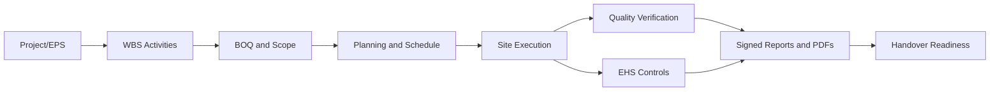

# SETU System Overview

[Back to Index](README.md) | Next: [System Context](01-architecture/system-context.md)

SETU is a construction project management platform for bringing project structure, planning, execution, quality, EHS, approvals, reporting, and handover readiness into one traceable system.

The aim is simple: every activity should move from planned scope to site execution to verification to signed records without losing responsibility, evidence, or approval history.

## Operating Scope

| Area | Business Purpose | Main Code Areas |
| --- | --- | --- |
| Admin | Users, roles, permissions, settings, data maintenance, access templates. | `backend/src/users`, `backend/src/roles`, `backend/src/permissions`, `backend/src/admin-data`, `frontend/src/pages/admin` |
| Projects and EPS | Project hierarchy, project profile, user assignment, project access. | `backend/src/eps`, `backend/src/projects`, `frontend/src/pages/EpsPage.tsx` |
| Planning | WBS, schedules, activity planning, issue tracker, project health, cost, budget. | `backend/src/wbs`, `backend/src/planning`, `frontend/src/pages/planning` |
| BOQ and Scope | BOQ import, measurements, quantity progress, scope linkage. | `backend/src/boq`, `frontend/src/pages/scope` |
| Site Execution | Measurement updates, execution logs, vendors, micro-progress, approvals. | `backend/src/execution`, `backend/src/micro-schedule`, `frontend/src/pages/execution` |
| Progress | Dashboard-level progress stats, burn rate, plan vs achieved, insights. | `backend/src/progress`, `frontend/src/views/progress` |
| Quality | RFI, checklist stages, pour clearance, pour card, snag, observations, audits, documents. | `backend/src/quality`, `backend/src/snag`, `frontend/src/views/quality` |
| EHS | Safety inspections, incidents, manhours, training, machinery, vehicles, legal and environmental registers. | `backend/src/ehs`, `frontend/src/views/ehs` |
| Design | Drawing register, upload, revision, preview, category management. | `backend/src/design`, `frontend/src/views/design` |
| WorkDoc and Vendors | Vendor master, work orders, BOQ linkage, execution vendor lookup. | `backend/src/workdoc`, `frontend/src/components/workdoc` |
| Dashboards and AI | Executive dashboards, custom dashboards, widgets, insight runs. | `backend/src/dashboard`, `backend/src/dashboard-builder`, `backend/src/ai-insights` |

## End-to-End Traceability

## Main Users

| User Type | Typical Actions |
| --- | --- |
| Admin | Configure users, roles, permissions, release strategies, templates, project settings, and reset/reverse exceptional workflow cases. |
| Planning team | Build WBS, schedule, BOQ mappings, budgets, project health, issue tracker, and recovery plans. |
| Site execution team | Record progress, measurement updates, micro-schedule logs, photos, and execution approvals. |
| QA/QC team | Manage RFIs, stages, checklist approvals, pour clearance, pour cards, observations, audits, and snag/de-snag. |
| EHS team | Record and close observations, inspections, incidents, manhours, training, machinery, legal and environmental data. |
| Vendors/temporary users | Perform assigned limited actions based on vendor access templates and project permissions. |
| Mobile field users | Capture field records, attachments, signatures, approvals, and status updates from site. |

