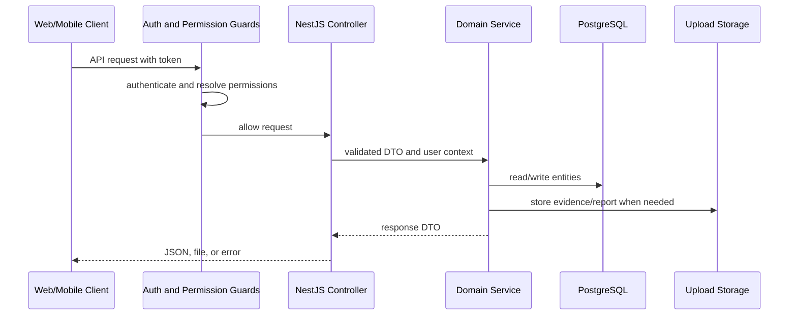
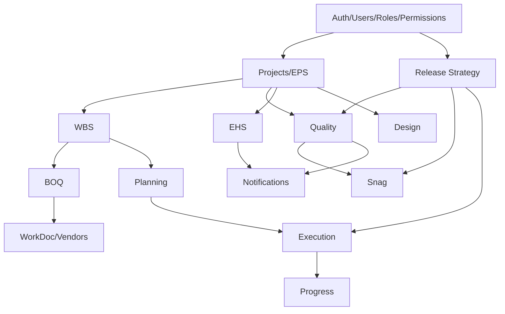

# Backend Architecture

[Back to Index](../README.md) | Previous: [System Context](system-context.md) | Next: [Frontend Architecture](frontend-architecture.md)

The backend is a NestJS application using TypeORM entities, migrations, controller/service module boundaries, JWT authentication, permission guards, release strategy workflow services, notifications, uploads, and report generation.

## Main Code Areas

| Area | Code Paths |
| --- | --- |
| Root application | `backend/src/app.module.ts`, `backend/src/main.ts`, `backend/src/data-source.ts` |
| Auth and users | `backend/src/auth`, `backend/src/users`, `backend/src/roles`, `backend/src/permissions` |
| Project structure | `backend/src/eps`, `backend/src/projects`, `backend/src/wbs` |
| Planning and controls | `backend/src/planning`, `backend/src/boq`, `backend/src/micro-schedule` |
| Execution and progress | `backend/src/execution`, `backend/src/progress`, `backend/src/labor` |
| Quality | `backend/src/quality`, `backend/src/snag` |
| EHS | `backend/src/ehs` |
| Design and documents | `backend/src/design`, `backend/src/workdoc` |
| Dashboards and AI | `backend/src/dashboard`, `backend/src/dashboard-builder`, `backend/src/ai-insights` |
| Shared services | `backend/src/common`, `backend/src/notifications`, `backend/src/audit`, `backend/src/app-config` |

## Request Lifecycle

## Controller Pattern

Controllers expose resource actions. Services own business rules. Entity repositories remain behind services.

Examples:

| Controller | Responsibility |
| --- | --- |
| `backend/src/quality/quality-inspection.controller.ts` | RFI/checklist inspection lifecycle, workflow advance/reject/reverse/delegate, reports. |
| `backend/src/quality/quality-pour-card.controller.ts` | Pour card and pre-pour clearance read/save/submit/approve/reject/PDF. |
| `backend/src/snag/snag.controller.ts` | Snag configuration, unit lists, readiness, items, rectification, closure, status PDF. |
| `backend/src/ehs/ehs.controller.ts` | EHS module data and dashboard operations. |
| `backend/src/execution/execution.controller.ts` | Measurement updates, logs, photos, micro-progress, execution approvals. |
| `backend/src/workdoc/workdoc.controller.ts` | Vendors, work orders, BOQ linkage, execution vendor lookup. |

## Module Dependency Pattern

