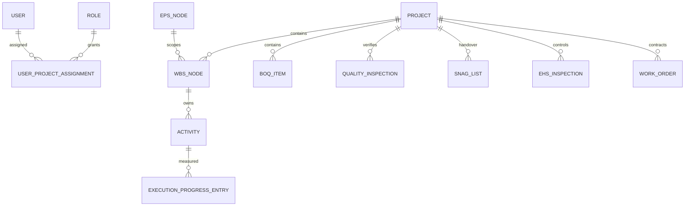

# Database Architecture

[Back to Index](../README.md) | Previous: [Frontend Architecture](frontend-architecture.md) | Next: [Permissions And Release Strategy](permissions-and-release-strategy.md)

SETU uses PostgreSQL with TypeORM entities and migrations. The database is the system of record for project hierarchy, users, permissions, planning, execution, quality, snag, EHS, vendors, reports, notifications, and audit history.

## Ownership By Module

| Module | Entity Paths |
| --- | --- |
| Users/Auth/Roles | `backend/src/auth/entities`, `backend/src/users`, `backend/src/roles`, `backend/src/permissions` |
| Projects/EPS | `backend/src/eps/*.entity.ts`, `backend/src/projects/entities` |
| WBS/Planning | `backend/src/wbs/entities`, `backend/src/planning/entities` |
| BOQ | `backend/src/boq/entities` |
| Execution | `backend/src/execution/entities`, `backend/src/micro-schedule/entities`, `backend/src/labor/entities` |
| Quality | `backend/src/quality/entities` |
| Snag | `backend/src/snag/entities` |
| EHS | `backend/src/ehs/entities` |
| WorkDoc | `backend/src/workdoc/entities` |
| Dashboard/AI | `backend/src/dashboard-builder/entities`, `backend/src/ai-insights/entities` |
| Audit/Notifications | `backend/src/audit`, `backend/src/notifications` |

## Migration Rules

1. Schema changes must be made through migrations in `backend/src/migrations`.
2. Migrations must handle existing production databases safely.
3. Enum migrations must check whether enum types exist before altering them.
4. New nullable fields should be used for backward-compatible deployment unless data is immediately available.
5. Data migrations should be idempotent where possible.

## Core Entity Relationship

