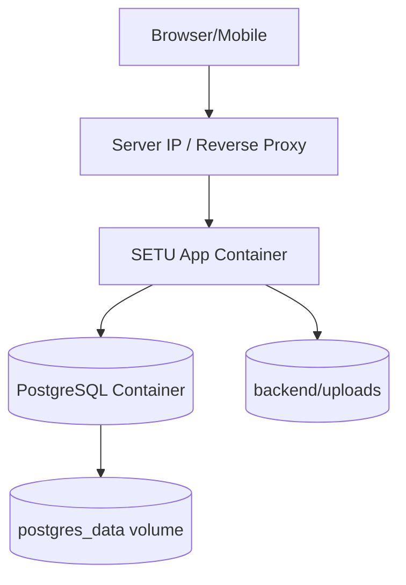

# Deployment And Backup

[Back to Index](../README.md) | Previous: [Reporting And PDF Architecture](reporting-and-pdf-architecture.md)

SETU production-style deployments use Docker Compose with an application container, PostgreSQL container, database volume, and upload volume.

## Server Runtime

## Deployment Flow

1. Pull or merge application code.
2. Resolve any local `docker-compose.yml` configuration differences intentionally.
3. Build the app container.
4. Start services with Docker Compose.
5. App startup waits for database readiness.
6. Migration lock is acquired.
7. Pending migrations run.
8. Backend starts and serves the built frontend.

## Backup Principle

Database backup is an operations activity, but it protects the core system of record. See [Database Backup](../07-operations/database-backup.md).

