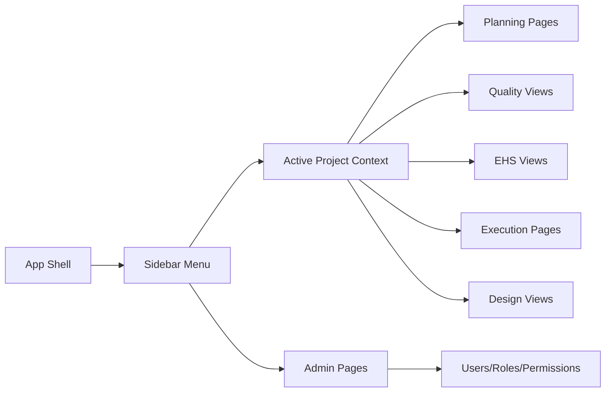

# Frontend Architecture

[Back to Index](../README.md) | Previous: [Backend Architecture](backend-architecture.md) | Next: [Database Architecture](database-architecture.md)

The frontend is a React/Vite application. It uses project/module pages, feature views, API service wrappers, shared layout, permission constants, and theme tokens.

## Main Code Areas

| Area | Code Paths |
| --- | --- |
| App shell | `frontend/src/App.tsx`, `frontend/src/DashboardRouter.tsx`, `frontend/src/components/layout/Sidebar.tsx` |
| API client | `frontend/src/api/axios.ts`, `frontend/src/api/baseUrl.ts`, `frontend/src/services` |
| Permissions and menu | `frontend/src/config/permissions.ts`, `frontend/src/config/menu.ts` |
| Admin pages | `frontend/src/pages/admin`, `frontend/src/pages/UserManagement.tsx`, `frontend/src/pages/RoleManagement.tsx` |
| Planning pages | `frontend/src/pages/planning`, `frontend/src/pages/PlanningPage.tsx`, `frontend/src/pages/SchedulePage.tsx` |
| Quality views | `frontend/src/views/quality` |
| EHS views | `frontend/src/views/ehs` |
| Design views | `frontend/src/views/design` |
| Dashboard views | `frontend/src/views/dashboard`, `frontend/src/views/dashboard-builder` |

## Navigation Model

## Service Pattern

Feature views use typed service wrappers instead of building endpoints directly in the component. Examples:

| Service | Used For |
| --- | --- |
| `frontend/src/services/quality.service.ts` | Quality inspections, approval dashboard, pour card, clearance card, documents. |
| `frontend/src/services/snag.service.ts` | Snag units, lists, configuration, items, analytics, PDFs. |
| `frontend/src/services/releaseStrategy.service.ts` | Release strategy configuration and levels. |
| `frontend/src/services/planning.service.ts` | Planning data and activity mappings. |
| `frontend/src/services/execution.service.ts` | Execution logs and approvals. |
| `frontend/src/services/work-doc.service.ts` | Vendors, work orders, linkage, pending vendor board. |

## UI Rule

Frontend screens should display only actions allowed by the backend contract. Permission-gated actions must still be validated on the backend because the mobile app and direct API calls use the same backend.

