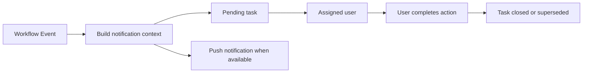

# Notifications And Audit Logs

[Back to Index](../README.md) | Previous: [Permissions And Release Strategy](permissions-and-release-strategy.md) | Next: [Reporting And PDF Architecture](reporting-and-pdf-architecture.md)

Notifications and audit logs provide operational traceability. Pending tasks show what needs user action; audit logs explain what changed and who changed it.

## Code References

| Area | Code Paths |
| --- | --- |
| Notifications | `backend/src/notifications` |
| Pending tasks API | `backend/src/notifications/pending-tasks.controller.ts` |
| Audit logs | `backend/src/audit` |
| System logs UI | `frontend/src/views/admin/SystemLogs.tsx` |
| Notification service client | `frontend/src/services/notification.service.ts` |

## Notification Flow

## Events That Should Notify

| Module | Events |
| --- | --- |
| Quality RFI | New approval level active, rejection, delegation, final approval. |
| Pour clearance/card | Card active, submitted, approval pending, rejected, approved. |
| Snag/de-snag | Ready for level snagging, snag raised, rectified, not satisfactory, level closure pending, stage closure. |
| EHS | Observation assigned, rectification submitted, closure pending, rejection. |
| Execution | Progress approval pending, approval/rejection result. |

## Audit Requirements

Audit entries should preserve: actor, module, action, project, entity type, entity id, old state, new state, timestamp, and remarks.

