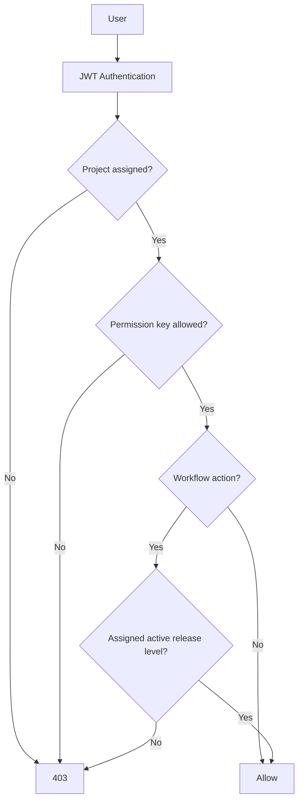

# Permissions And Release Strategy

[Back to Index](../README.md) | Previous: [Database Architecture](database-architecture.md) | Next: [Notifications And Audit Logs](notifications-and-audit-logs.md)

SETU uses two layers of control:

1. Role and permission keys decide whether a user can access a module/action.
2. Release strategy decides whether the user can act at the active workflow level.

## Code References

| Area | Code Paths |
| --- | --- |
| Permission entities and service | `backend/src/permissions` |
| Role management | `backend/src/roles` |
| Project assignment | `backend/src/projects` |
| Release strategy entities/service | `backend/src/planning/entities/release-strategy*.ts`, `backend/src/planning/release-strategy.service.ts` |
| Web permission constants | `frontend/src/config/permissions.ts` |
| Release strategy UI | `frontend/src/pages/planning/ReleaseStrategyPage.tsx` |

## Access Decision

## Release Strategy Usage

| Process | Use |
| --- | --- |
| RFI approval | Checklist/stage approval levels. |
| Pour clearance | Configurable activation after checklist stage and/or RFI approval level. |
| Pour card | Configurable activation after checklist stage and/or RFI approval level, with clearance dependency. |
| Snag/de-snag | Checker levels inside each snag stage. |
| Execution approvals | Progress approval workflows where configured. |

## Admin Governance

Admin actions that override normal flow, reset records, delete operational points, reverse approvals, or force closure must be logged in app logs/audit logs with user, timestamp, target entity, previous state, new state, and remarks.

