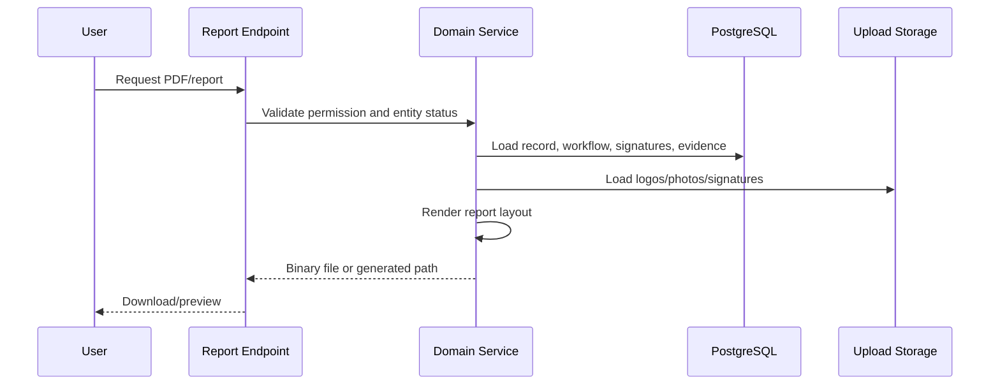

# Reporting And PDF Architecture

[Back to Index](../README.md) | Previous: [Notifications And Audit Logs](notifications-and-audit-logs.md) | Next: [Deployment And Backup](deployment-and-backup.md)

Reporting and PDF generation are core SETU outputs. They convert approved workflow data into traceable records with project details, logos, evidence, signatures, timestamps, and status history.

This document covers business reports and PDFs generated by the app. It does not treat auxiliary processing services as standalone product modules.

## Core Outputs

| Output | Source Data | Main Code Paths |
| --- | --- | --- |
| RFI/checklist report | Quality inspection, stages, checklist items, workflow history, attachments. | `backend/src/quality/quality-inspection.controller.ts`, `backend/src/quality` |
| Pour card PDF | Pour card data, concrete details, linked inspection, approval state, signatures, project logo. | `backend/src/quality/quality-pour-card.controller.ts` |
| Pre-pour clearance PDF | Clearance signatories, QR/mobile signatures, attachments, approval state. | `backend/src/quality/quality-pour-card.controller.ts` |
| Snag status PDF | Snag list, rounds, levels, rooms, activities, points, photos, closure signatures, vendors. | `backend/src/snag/snag.controller.ts`, `backend/src/snag` |
| WIP/progress reports | Execution/progress data, measurements, plan vs achieved, dashboard summaries. | `backend/src/execution`, `backend/src/progress`, `backend/src/dashboard` |
| Dashboard reports | Dashboard builder widgets and data-source queries. | `backend/src/dashboard-builder` |

## Report Generation Flow

## Layout Rules

1. Reports must use project properties for project identity and logo.
2. Text must wrap within fixed-width cells.
3. Long lists must page break cleanly.
4. Photos should be rendered as thumbnails in tabular format.
5. Signatures must include name, designation/company where available, date/time, and approval identity.
6. Rejected/not satisfactory history must remain visible where it affects final status.

