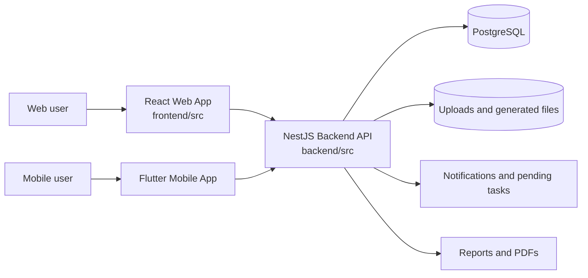

# System Context

[Back to Index](../README.md) | Previous: [System Overview](../00-system-overview.md) | Next: [Backend Architecture](backend-architecture.md)

SETU has a web client, backend API, PostgreSQL database, persisted upload storage, notification services, and a mobile application integration surface.

## Runtime Responsibilities

| Runtime | Responsibility |
| --- | --- |
| React Web App | Admin, planning, quality, EHS, dashboards, configuration, document screens. |
| Flutter Mobile App | Field execution, quality actions, media capture, signatures, mobile approvals. |
| NestJS Backend | Authentication, authorization, business workflows, persistence, report generation, audit, notifications. |
| PostgreSQL | System of record for project, workflow, checklist, snag, EHS, planning, user, and audit data. |
| Upload Storage | Photos, attachments, signatures, generated reports, and evidence files. |

## Core Boundary

PDF generation and report generation are core app outputs. External or auxiliary tools used internally are implementation details and are not documented as standalone business modules in this final pack.

