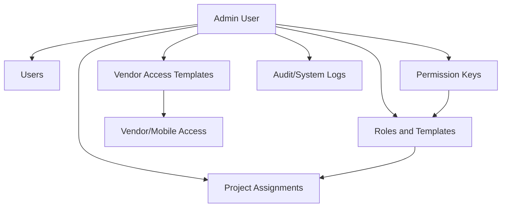

# Admin Module

[Back to Index](../README.md) | Related: [Permissions And Release Strategy](../01-architecture/permissions-and-release-strategy.md)

The Admin module controls platform governance: users, roles, permissions, templates, vendor access, system settings, data maintenance, plugins, and audit visibility.

## Code References

| Layer | Code Paths |
| --- | --- |
| Backend | `backend/src/users`, `backend/src/roles`, `backend/src/permissions`, `backend/src/admin-data`, `backend/src/app-config`, `backend/src/audit`, `backend/src/plugins` |
| Frontend | `frontend/src/pages/UserManagement.tsx`, `frontend/src/pages/RoleManagement.tsx`, `frontend/src/pages/admin`, `frontend/src/views/admin` |
| Config | `frontend/src/config/permissions.ts`, `frontend/src/config/menu.ts` |

## Main Capabilities

- Manage users and passwords.
- Upload and maintain user signatures.
- Manage roles, role presets, and role templates.
- Assign project users and control project access.
- Configure permission keys.
- Manage vendor access templates.
- Review system logs and audit records.
- Perform controlled data maintenance corrections.

## Flow

## Important APIs

| API Area | Examples |
| --- | --- |
| Users | `POST /users`, `GET /users`, `GET /users/me`, `PUT /users/:id`, `PUT /users/me/signature` |
| Roles | `GET /roles`, `POST /roles`, `PUT /roles/:id`, `DELETE /roles/:id` |
| Permissions | `GET /permissions` |
| Project team | `POST /projects/:projectId/assign`, `GET /projects/:projectId/team` |
| Data maintenance | `GET /admin/data-maintenance/tables`, `PATCH /admin/data-maintenance/tables/:tableName/rows/:primaryKeyValue` |

