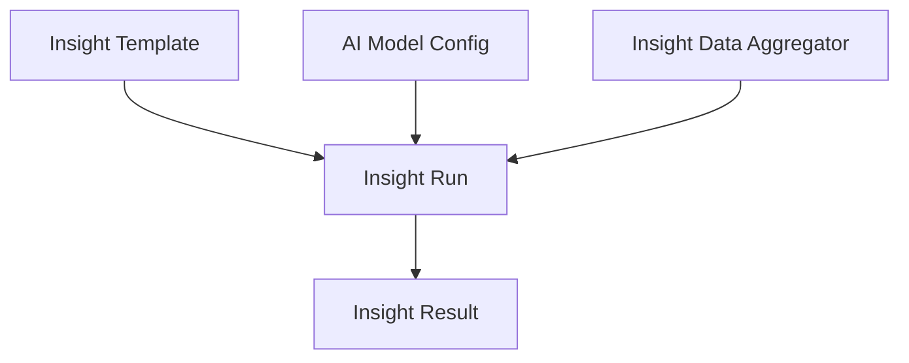

# AI Insights Module

[Back to Index](../README.md)

AI Insights stores model configuration, insight templates, insight runs, and aggregated project data used for analysis outputs.

## Code References

| Layer | Code Paths |
| --- | --- |
| Backend | `backend/src/ai-insights` |
| Frontend | `frontend/src/pages/ai-insights`, `frontend/src/services/aiInsights.service.ts` |

## Flow

## Notes

The module should only use project data the user is permitted to access. Insight output should reference source data where possible.

