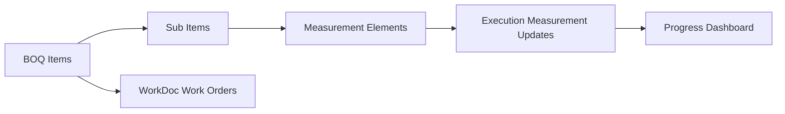

# BOQ And Scope Module

[Back to Index](../README.md) | Related: [WBS And Planning](wbs-and-planning.md), [Site Execution](site-execution.md)

The BOQ module manages project quantities, BOQ items, sub-items, measurement elements, imports, exports, and quantity progress linkage.

## Code References

| Layer | Code Paths |
| --- | --- |
| Backend | `backend/src/boq` |
| Frontend | `frontend/src/pages/scope/BoqPage.tsx`, `frontend/src/pages/scope/MeasurementManager.tsx`, `frontend/src/services/boq.service.ts` |

## Main Capabilities

- Import and export BOQ.
- Create BOQ items, sub-items, and measurement elements.
- Recalculate project BOQ.
- Import measurement templates.
- Record BOQ progress quantities.

## Flow

## Important APIs

| API Area | Examples |
| --- | --- |
| BOQ | `GET /boq/project/:projectId`, `POST /boq`, `PATCH /boq/:id`, `DELETE /boq/:id` |
| Import/export | `GET /boq/template`, `POST /boq/import/:projectId`, `GET /boq/export/:projectId` |
| Measurements | `POST /boq/measurement`, `PATCH /boq/measurement/:id`, `POST /boq/measurements/import/:projectId/:boqItemId` |

