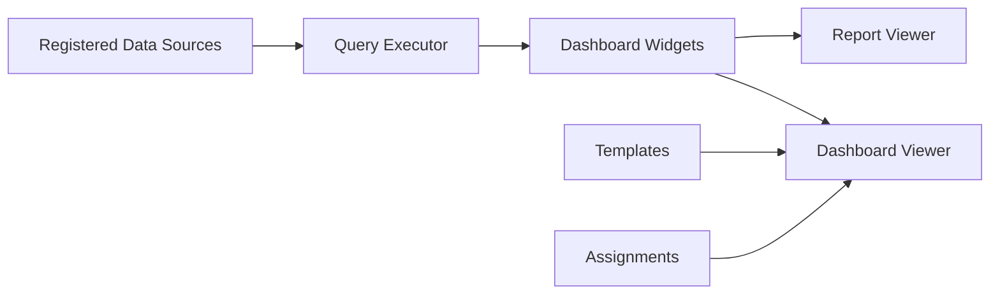

# Dashboard And Analytics Module

[Back to Index](../README.md)

Dashboard and analytics provide executive summaries, management dashboards, dashboard builder, report builder, data-source registry, and widget rendering.

## Code References

| Layer | Code Paths |
| --- | --- |
| Backend | `backend/src/dashboard`, `backend/src/dashboard-builder` |
| Frontend | `frontend/src/views/dashboard`, `frontend/src/views/dashboard-builder`, `frontend/src/services/dashboard-builder.service.ts` |

## Flow

## Dashboard Builder APIs

Examples include `GET /dashboard-builder`, `POST /dashboard-builder`, `GET /dashboard-builder/data-sources`, `POST /dashboard-builder/data-sources/:key/query`, widget update/delete, assignment, clone, and template application endpoints.

