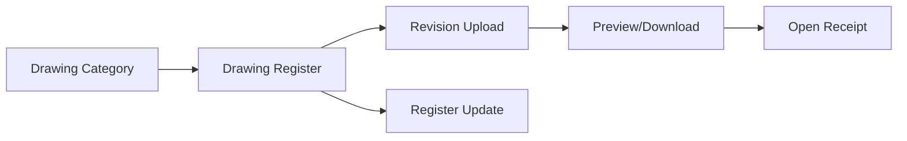

# Design And Drawings Module

[Back to Index](../README.md)

The Design module manages drawing categories, drawing register entries, uploads, revisions, previews, downloads, and open receipts.

## Code References

| Layer | Code Paths |
| --- | --- |
| Backend | `backend/src/design` |
| Frontend | `frontend/src/views/design` |

## Flow

## Important APIs

| API Area | Examples |
| --- | --- |
| Categories | `GET /design/categories`, `POST /design/categories` |
| Register | `GET /design/:projectId/register`, `POST /design/:projectId/register`, `PATCH /design/:projectId/register/:registerId` |
| Files | `POST /design/:projectId/upload`, `GET /design/:projectId/download/:revisionId`, `GET /design/:projectId/preview/:revisionId` |

