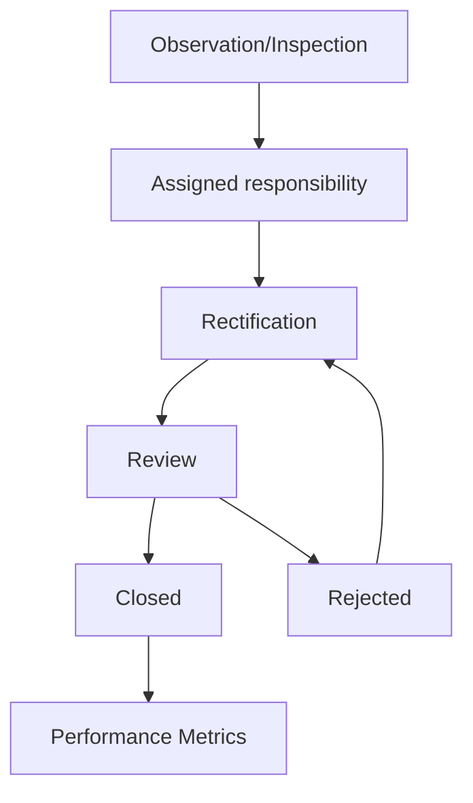

# EHS Module

[Back to Index](../README.md) | Related: [EHS Inspection Workflow](../03-workflows/ehs-inspection-workflow.md)

The EHS module manages safety and environmental controls across inspections, observations, incidents, manhours, training, machinery, vehicles, legal registers, and performance reporting.

## Code References

| Layer | Code Paths |
| --- | --- |
| Backend | `backend/src/ehs` |
| Frontend | `frontend/src/views/ehs`, `frontend/src/views/quality/subviews/SiteObservationPanel.tsx` for shared observation patterns |

## Main Capabilities

- EHS overview and performance tracking.
- Safety observations and rectification/closure.
- Inspections.
- Incident register.
- Manhours.
- Training and competency.
- Machinery and vehicle tracking.
- Legal and environmental registers.

## Flow

## Important APIs

EHS controllers are under `backend/src/ehs`, including `ehs.controller.ts` and `ehs-observation.controller.ts`.

