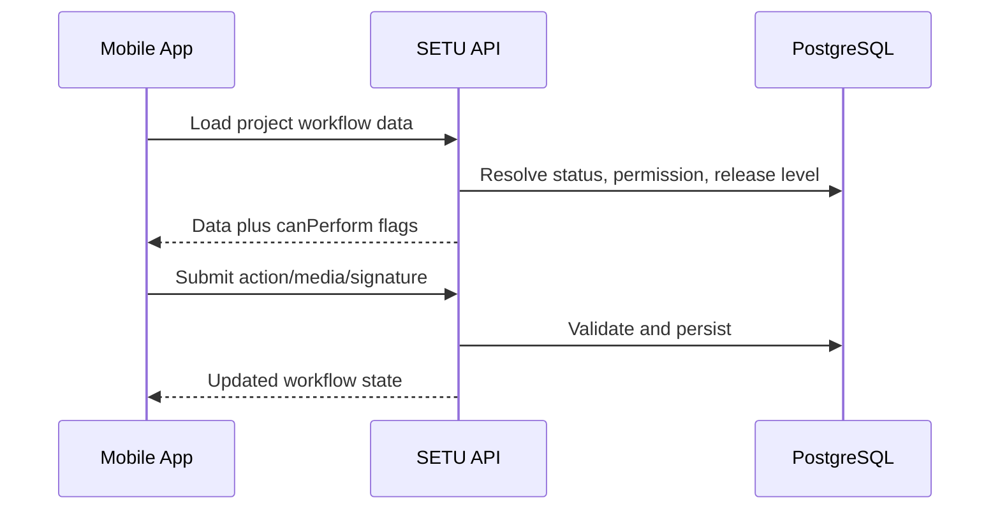

# Mobile App Integration

[Back to Index](../README.md) | Related: [Mobile API Contract](../06-mobile-handoff/mobile-api-contract.md)

The mobile app consumes the same backend APIs as the web app for field workflows. Backend validation remains the source of truth for permissions, release strategy levels, status transitions, and required evidence.

## Backend-Owned Contract

| Area | Backend Responsibility |
| --- | --- |
| Authentication | Token validation and user identity. |
| Permissions | Decide whether action is allowed. |
| Workflow status | Return current state and available actions. |
| Evidence rules | Tell mobile when photos/signatures are mandatory. |
| Reports | Generate PDFs from stored backend data. |

## Mobile Integration Flow

## Rule

Do not implement mobile-only workflow shortcuts. Mobile must use backend-provided `can*` action flags and status fields.

