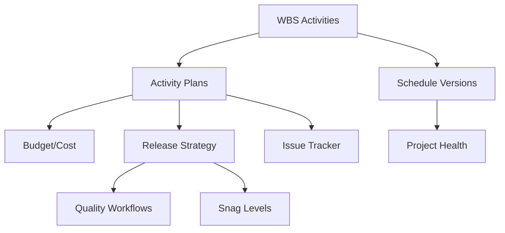

# Planning And Schedule Module

[Back to Index](../README.md) | Related: [Permissions And Release Strategy](../01-architecture/permissions-and-release-strategy.md)

Planning covers activity planning, schedule versions, release strategy, issue tracker, custom trackers, project health, budget, cost, building line coordinates, customer milestones, and recovery controls.

## Code References

| Layer | Code Paths |
| --- | --- |
| Backend | `backend/src/planning`, `backend/src/milestone`, `backend/src/micro-schedule` |
| Frontend | `frontend/src/pages/planning`, `frontend/src/services/planning.service.ts`, `frontend/src/services/releaseStrategy.service.ts` |

## Main Capabilities

- Maintain release strategy levels and conditions.
- Manage planning extensions and activity plans.
- Track project health.
- Manage issue tracker departments, issues, steps, tags, and notifications.
- Maintain budget and cost.
- Manage customer milestones.
- Support recovery plans and schedule versions.

## Flow

## Important APIs

Planning controllers are split by feature under `backend/src/planning`, including `planning.controller.ts`, `budget.controller.ts`, `cost.controller.ts`, `custom-tracker.controller.ts`, `planning-extension.controller.ts`, and `project-health.controller.ts`.

