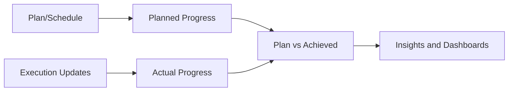

# Progress Module

[Back to Index](../README.md) | Related: [Site Execution](site-execution.md), [Dashboard And Analytics](dashboard-and-analytics.md)

The Progress module converts planning and execution records into project performance views.

## Code References

| Layer | Code Paths |
| --- | --- |
| Backend | `backend/src/progress`, `backend/src/dashboard` |
| Frontend | `frontend/src/views/progress`, `frontend/src/services/project-health.service.ts` |

## Main Capabilities

- Project progress statistics.
- Plan vs achieved comparison.
- Efficiency and progress insights.
- Burn rate cards and charts.
- Schedule comparison.

## Flow

## Important APIs

| API Area | Examples |
| --- | --- |
| Progress | `GET /progress/stats/:projectId`, `GET /progress/plan-vs-achieved/:projectId`, `GET /progress/insights/:projectId` |

