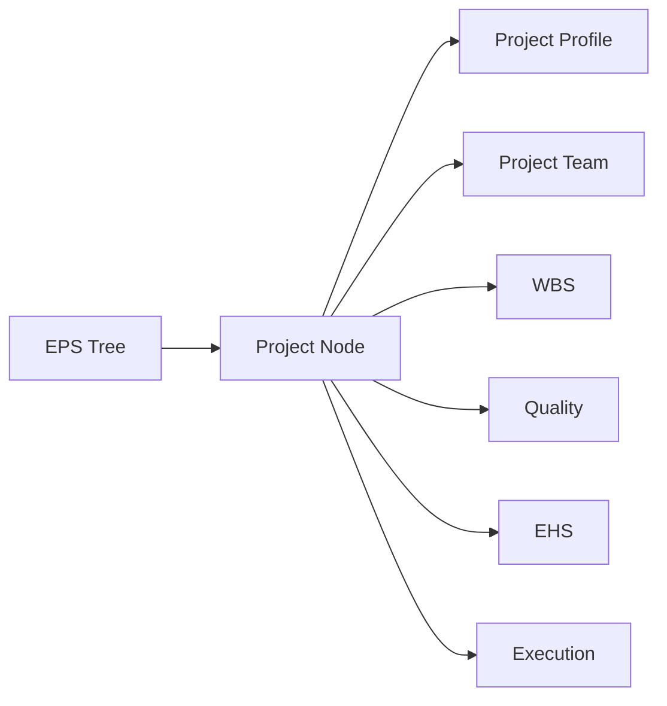

# Projects And EPS Module

[Back to Index](../README.md) | Related: [WBS And Planning](wbs-and-planning.md)

Projects and EPS define the enterprise/project hierarchy and the active project context used by every operational module.

## Code References

| Layer | Code Paths |
| --- | --- |
| Backend | `backend/src/eps`, `backend/src/projects` |
| Frontend | `frontend/src/pages/EpsPage.tsx`, `frontend/src/components/layout/Sidebar.tsx` |

## Main Capabilities

- Create and edit EPS/project nodes.
- Import EPS structure.
- Maintain project profile/properties.
- Assign users to projects.
- Check user permission against project/EPS node.

## Flow

## Important APIs

| API Area | Examples |
| --- | --- |
| EPS | `GET /eps`, `POST /eps`, `GET /eps/:id/tree`, `PATCH /eps/:id/profile` |
| Project team | `POST /projects/:projectId/assign`, `GET /projects/:projectId/team`, `PATCH /projects/:projectId/users/:userId/status` |

