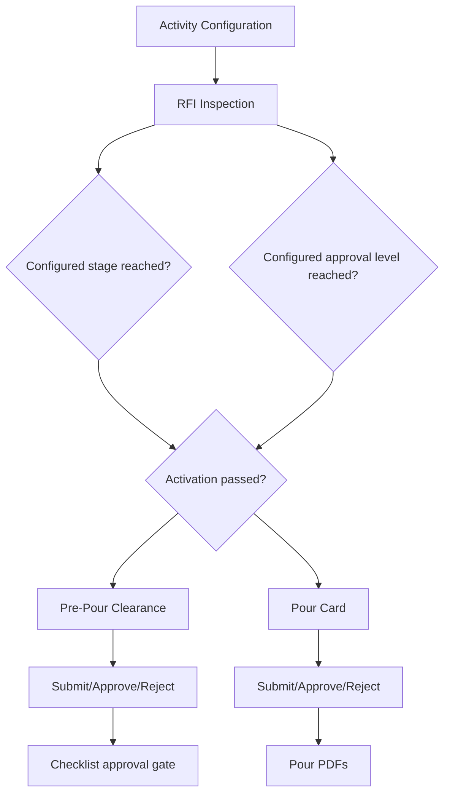

# Quality Pour Clearance And Pour Card

[Back to Index](../README.md) | Related: [Pour Clearance Workflow](../03-workflows/pour-clearance-workflow.md), [Pour Card Workflow](../03-workflows/pour-card-workflow.md)

Pour clearance and pour card are quality-controlled concrete workflows linked to an RFI/checklist inspection. Their visibility and approval behavior are controlled by activity configuration, checklist stage, RFI approval level, and clearance dependency.

## Code References

| Layer | Code Paths |
| --- | --- |
| Backend | `backend/src/quality/quality-pour-card.controller.ts`, `backend/src/quality/quality-pour-card.service.ts`, `backend/src/quality/entities` |
| Frontend | `frontend/src/views/quality/QualityApprovalsPage.tsx`, `frontend/src/views/quality/sequencer`, `frontend/src/services/quality.service.ts` |

## Activation Inputs

| Input | Meaning |
| --- | --- |
| Attach Pour Clearance Card | Activity requires pre-pour clearance. |
| Attach Pour Card | Activity requires pour card. |
| Activate After Stage | Card becomes visible after a selected checklist stage reaches the required state. |
| Activate At RFI Approval Level | Card becomes visible after selected release-strategy approval level. |
| Clearance Required Before Next Approvals | Later checklist approvals may wait for clearance submission or formal clearance approval, based on configuration. |

## Flow

## Important APIs

| API Area | Examples |
| --- | --- |
| Pour card | `GET /quality/inspections/:inspectionId/pour-card`, `PUT /quality/inspections/:inspectionId/pour-card`, `POST /quality/inspections/:inspectionId/pour-card/submit` |
| Pour approval | `POST /quality/inspections/:inspectionId/pour-card/approve`, `POST /quality/inspections/:inspectionId/pour-card/reject` |
| Clearance | `GET /quality/inspections/:inspectionId/pre-pour-clearance`, `PUT /quality/inspections/:inspectionId/pre-pour-clearance`, `POST /quality/inspections/:inspectionId/pre-pour-clearance/submit` |
| Clearance approval | `POST /quality/inspections/:inspectionId/pre-pour-clearance/approve`, `POST /quality/inspections/:inspectionId/pre-pour-clearance/reject` |
| PDFs | `GET /quality/inspections/:inspectionId/pour-card/pdf`, `GET /quality/inspections/:inspectionId/pre-pour-clearance/pdf` |

