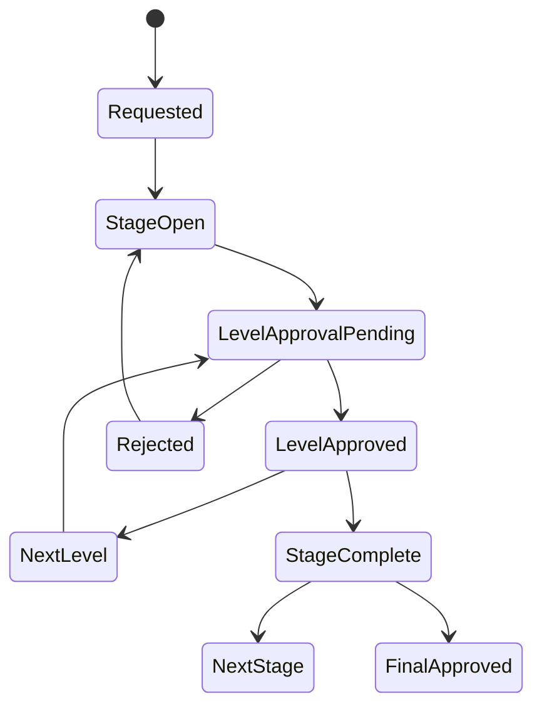

# Quality RFI Checklists

[Back to Index](../README.md) | Related: [RFI Approval Workflow](../03-workflows/rfi-approval-workflow.md)

RFI/checklist workflows control staged QA/QC approval for site activities. Checklist stages can unlock dependent workflows such as pre-pour clearance and pour card based on configured activation rules.

## Code References

| Layer | Code Paths |
| --- | --- |
| Backend | `backend/src/quality/quality-inspection.controller.ts`, `backend/src/quality/checklist-template.controller.ts`, `backend/src/quality/quality-activity.controller.ts` |
| Frontend | `frontend/src/views/quality/QualityApprovalsPage.tsx`, `frontend/src/views/quality/InspectionRequestPage.tsx`, `frontend/src/views/quality/subviews/QualityChecklist.tsx` |

## Flow

## Important APIs

| API Area | Examples |
| --- | --- |
| Inspections | `GET /quality/inspections`, `POST /quality/inspections`, `GET /quality/inspections/:id` |
| Stage update | `PATCH /quality/inspections/:id/stages/:stageId`, `POST /quality/inspections/:id/stages/:stageId/approve` |
| Workflow | `GET /quality/inspections/:id/workflow`, `POST /quality/inspections/:id/workflow/advance`, `POST /quality/inspections/:id/workflow/reject` |
| Report | `GET /quality/inspections/:id/report` |

