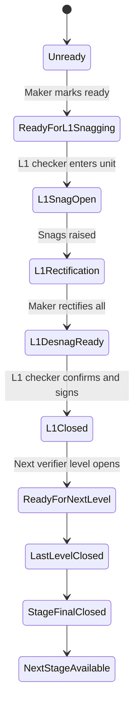

# Quality Snag De-snag Module

[Back to Index](../README.md) | Related: [Snag De-snag Workflow](../03-workflows/snag-desnag-workflow.md), [Snag Entities](../05-data-model/snag-entities.md)

Snag/de-snag manages unit handover readiness through configured snag stages and release-strategy-driven verifier levels inside each stage.

## Code References

| Layer | Code Paths |
| --- | --- |
| Backend | `backend/src/snag`, `backend/src/quality/quality.controller.ts` structure endpoints |
| Frontend | `frontend/src/views/quality/SnagManagementPage.tsx`, `frontend/src/views/quality/subviews/SnagDesnagConfigPage.tsx`, `frontend/src/services/snag.service.ts` |

## Configuration

- Define N snag stages.
- Define activities per stage.
- Add checklist activities or custom activities.
- Add common snag points under each activity.
- Configure photo mandatory switch per stage/phase when required.
- Configure release strategy levels for checker/verifier levels.

## Stage And Level Flow

## Important APIs

| API Area | Examples |
| --- | --- |
| Config | `GET /snag/:projectId/config/process-steps`, `POST /snag/:projectId/config/process-steps`, `POST /snag/:projectId/config/activity-map` |
| Units | `GET /snag/:projectId/units`, `GET /snag/:projectId/analytics`, `GET /snag/:projectId/vendors` |
| Lists | `POST /snag/:projectId/lists`, `GET /snag/:projectId/lists/:listId`, `POST /snag/:projectId/lists/:listId/mark-current-round-ready` |
| Items | `POST /snag/:projectId/lists/:listId/rounds/:roundNumber/items`, `POST /snag/:projectId/items/:itemId/rectify`, `POST /snag/:projectId/items/:itemId/close` |
| Admin/reset | `POST /snag/:projectId/lists/:listId/reset-ready`, delete item endpoints, admin-only reversal/reset endpoints where configured. |
| PDF | `GET /snag/:projectId/lists/:listId/rounds/:roundNumber/status-report.pdf` |

