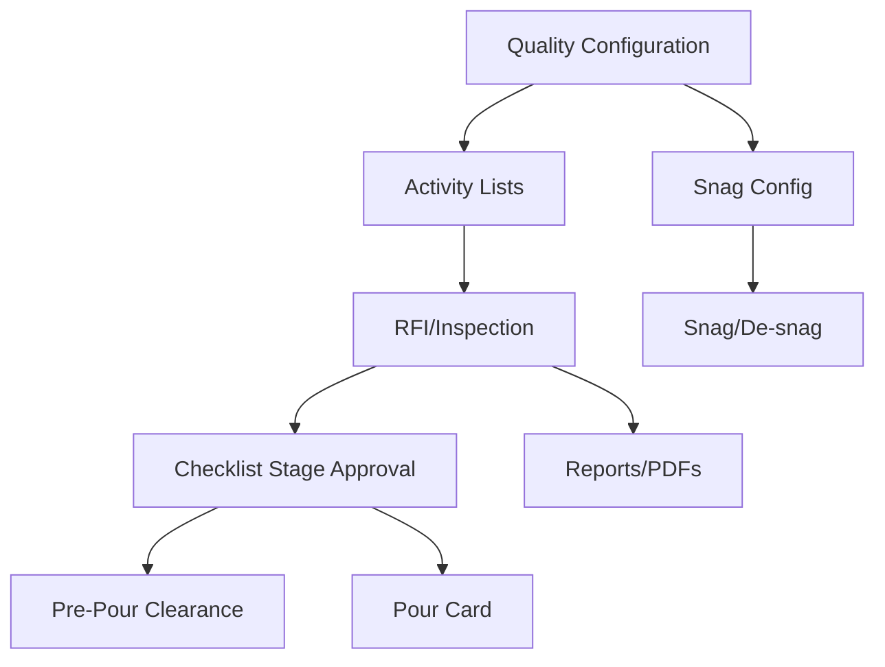

# Quality Module

[Back to Index](../README.md) | Related: [RFI Checklists](quality-rfi-checklists.md), [Pour Clearance And Pour Card](quality-pour-clearance-and-pour-card.md), [Snag De-snag](quality-snag-desnag.md)

The Quality module manages construction quality verification: activity lists, inspections/RFIs, checklist stages, material testing, pour clearance, pour cards, site observations, NC register, ratings, audits, documents, structure, and snag/de-snag.

## Code References

| Layer | Code Paths |
| --- | --- |
| Backend | `backend/src/quality`, `backend/src/snag` |
| Frontend | `frontend/src/views/quality`, `frontend/src/services/quality.service.ts`, `frontend/src/services/snag.service.ts` |

## Main Submodules

| Submodule | Document |
| --- | --- |
| RFI and checklists | [Quality RFI Checklists](quality-rfi-checklists.md) |
| Pour clearance and pour card | [Quality Pour Clearance And Pour Card](quality-pour-clearance-and-pour-card.md) |
| Snag and de-snag | [Quality Snag De-snag](quality-snag-desnag.md) |

## Flow

## Main Screens

- `QualityProjectDashboard.tsx`
- `ActivityListsPage.tsx`
- `QualityApprovalsPage.tsx`
- `InspectionRequestPage.tsx`
- `SequenceManagerPage.tsx`
- `SnagManagementPage.tsx`
- `QualityStructureManager.tsx`
- `SnagDesnagConfigPage.tsx`

