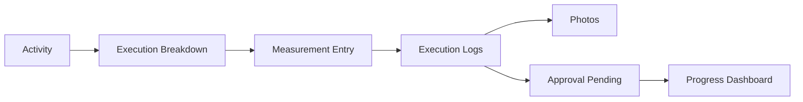

# Site Execution Module

[Back to Index](../README.md) | Related: [Progress](progress.md), [WorkDoc And Vendors](workdoc-and-vendors.md)

Site Execution records field progress, measurement updates, execution logs, photos, micro-progress, vendor linkage, and execution approvals.

## Code References

| Layer | Code Paths |
| --- | --- |
| Backend | `backend/src/execution`, `backend/src/micro-schedule`, `backend/src/labor` |
| Frontend | `frontend/src/pages/execution`, `frontend/src/pages/micro-schedule`, `frontend/src/views/labor` |

## Main Capabilities

- Submit measurement progress.
- View and edit execution logs.
- Attach photos to logs.
- Get execution breakdown by activity/EPS node.
- Get vendors and work-order items for activity.
- Submit and approve/reject execution progress.
- Maintain daily labor and activity labor updates.

## Flow

## Important APIs

| API Area | Examples |
| --- | --- |
| Execution | `POST /execution/:projectId/measurements`, `GET /execution/:projectId/logs`, `PATCH /execution/logs/:logId` |
| Photos | `POST /execution/logs/:logId/photos` |
| Approvals | `GET /execution/:projectId/approvals/pending`, `POST /execution/approve`, `POST /execution/reject` |
| Micro progress | `POST /execution/progress/micro` |

