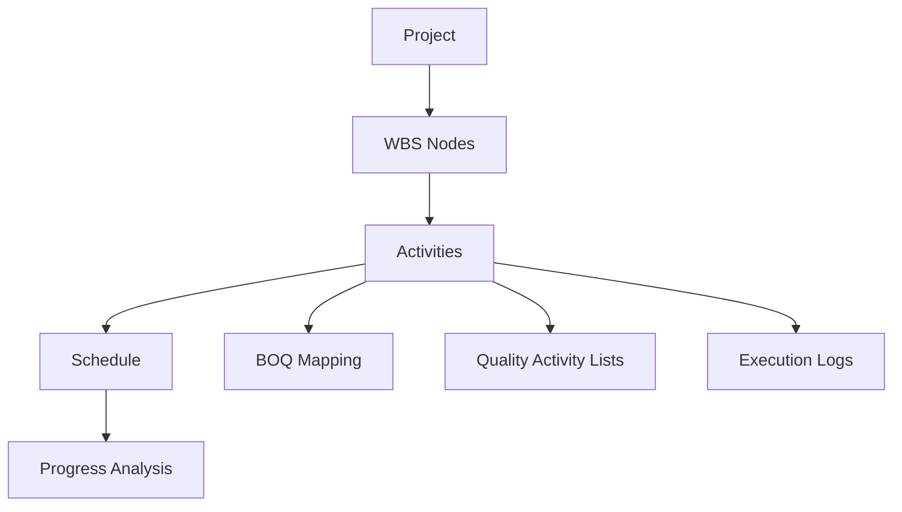

# WBS And Planning Foundation

[Back to Index](../README.md) | Related: [Planning And Schedule](planning-and-schedule.md), [BOQ And Scope](boq-and-scope.md)

WBS is the activity backbone of SETU. Planning, BOQ linkage, execution, quality, and progress all depend on a stable activity structure.

## Code References

| Layer | Code Paths |
| --- | --- |
| Backend | `backend/src/wbs`, `backend/src/planning` |
| Frontend | `frontend/src/pages/WbsPage.tsx`, `frontend/src/pages/PlanningPage.tsx`, `frontend/src/pages/SchedulePage.tsx` |

## Main Capabilities

- Create WBS nodes and activities.
- Save/apply WBS templates.
- Import WBS preview and commit.
- Manage calendars.
- Import, calculate, repair, and export schedules.

## Flow

## Important APIs

| API Area | Examples |
| --- | --- |
| WBS | `GET /projects/:projectId/wbs`, `POST /projects/:projectId/wbs`, `POST /projects/:projectId/wbs/:nodeId/activities` |
| Templates | `GET /wbs/templates`, `POST /wbs/templates`, `POST /projects/:projectId/wbs/templates/:templateId/apply` |
| Schedule | `GET /projects/:projectId/schedule`, `POST /projects/:projectId/schedule/calculate`, `POST /projects/:projectId/schedule/import` |

