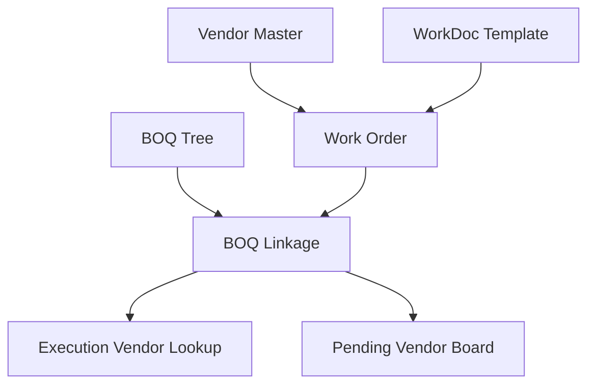

# WorkDoc And Vendors Module

[Back to Index](../README.md) | Related: [Vendor Access Workflow](../03-workflows/vendor-access-workflow.md)

WorkDoc manages vendor master data, work orders, templates, BOQ linkage, available quantities, pending vendor boards, and execution vendor lookup.

## Code References

| Layer | Code Paths |
| --- | --- |
| Backend | `backend/src/workdoc` |
| Frontend | `frontend/src/components/workdoc`, `frontend/src/services/work-doc.service.ts`, `frontend/src/pages/VendorMappingPage.tsx` |

## Flow

## Important APIs

| API Area | Examples |
| --- | --- |
| Vendors | `GET /workdoc/vendors`, `POST /workdoc/vendors`, `POST /workdoc/vendors/:id/update` |
| Work orders | `GET /workdoc/:projectId/work-orders`, `GET /workdoc/work-orders/:woId`, `POST /workdoc/work-orders/:woId/update` |
| Linkage | `GET /workdoc/:projectId/linkage-data`, `POST /workdoc/items/:itemId/map`, `GET /workdoc/:projectId/available-boq-qty` |
| Execution lookup | `GET /workdoc/execution/vendors-for-activity`, `GET /workdoc/execution/wo-items-for-activity` |

