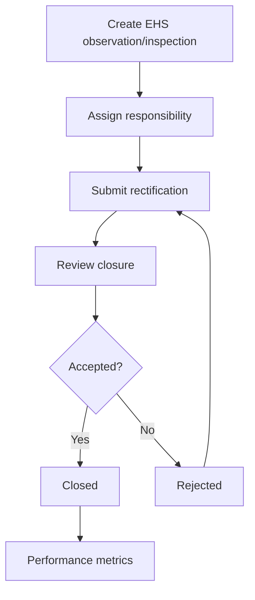

# EHS Inspection Workflow

[Back to Index](../README.md) | Related: [EHS](../02-modules/ehs.md)

```mermaid
flowchart TD
    Create[Create EHS observation/inspection] --> Assign[Assign responsibility]
    Assign --> Rectify[Submit rectification]
    Rectify --> Review[Review closure]
    Review --> Close{Accepted?}
    Close -- Yes --> Closed[Closed]
    Close -- No --> Rejected[Rejected]
    Rejected --> Rectify
    Closed --> Metrics[Performance metrics]
```

## Source Code

- Backend: `backend/src/ehs`
- Frontend: `frontend/src/views/ehs`

