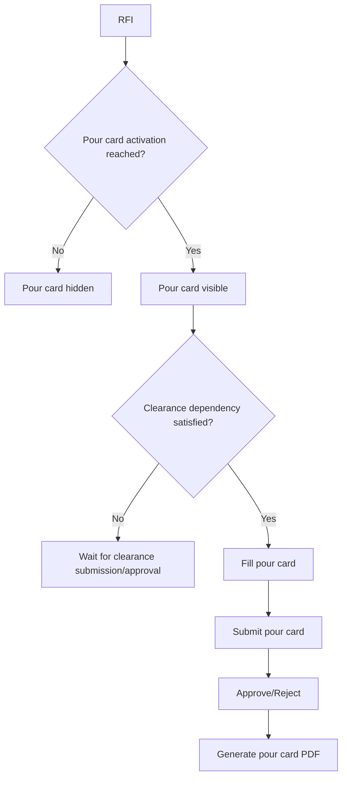

# Pour Card Workflow

[Back to Index](../README.md) | Related: [Pour Clearance And Pour Card](../02-modules/quality-pour-clearance-and-pour-card.md)

## Source Code

- Backend: `backend/src/quality/quality-pour-card.controller.ts`
- Frontend service: `frontend/src/services/quality.service.ts`

## Important Rules

- Pour card visibility and approval are separate concepts.
- Pour card may become visible at a selected checklist stage or RFI approval level.
- Clearance dependency is evaluated according to the configured rule.

