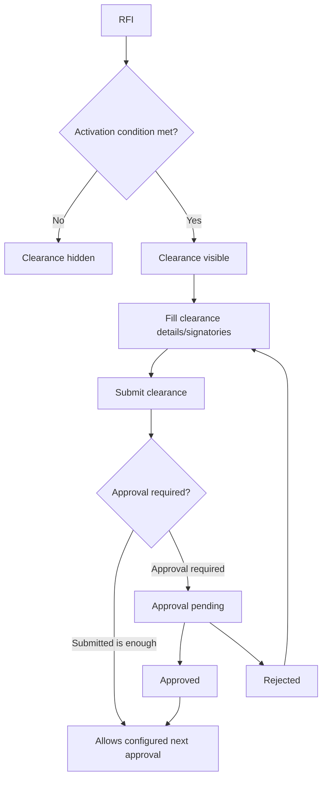

# Pour Clearance Workflow

[Back to Index](../README.md) | Related: [Pour Clearance And Pour Card](../02-modules/quality-pour-clearance-and-pour-card.md)

## Source Code

- Backend: `backend/src/quality/quality-pour-card.controller.ts`
- Frontend: `frontend/src/views/quality/QualityApprovalsPage.tsx`
- Activity configuration: `frontend/src/views/quality/sequencer`

## Important Rules

- Visibility is based on configured checklist stage and/or RFI approval level.
- The gate before later checklist approval should evaluate the configured clearance requirement.
- If "submitted is enough" is selected, formal clearance approval must not block the later checklist level.

