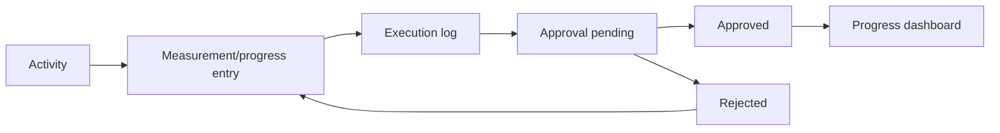

# Progress Update Workflow

[Back to Index](../README.md) | Related: [Site Execution](../02-modules/site-execution.md), [Progress](../02-modules/progress.md)

## Source Code

- Backend: `backend/src/execution`, `backend/src/progress`
- Frontend: `frontend/src/pages/execution`, `frontend/src/views/progress`

