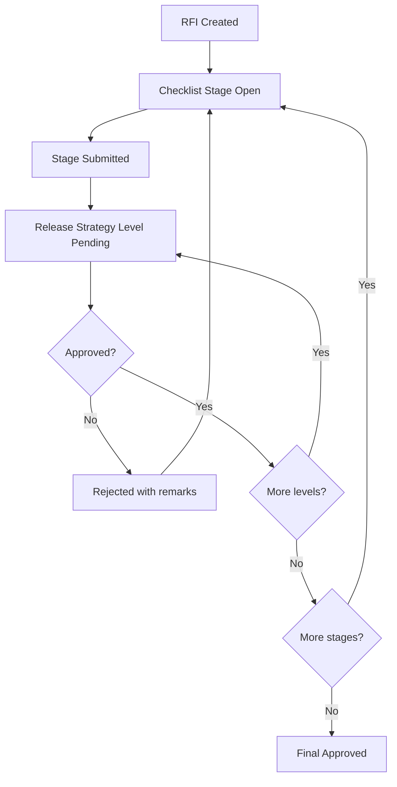

# RFI Approval Workflow

[Back to Index](../README.md) | Related: [Quality RFI Checklists](../02-modules/quality-rfi-checklists.md)

## Source Code

- Backend: `backend/src/quality/quality-inspection.controller.ts`
- Frontend: `frontend/src/views/quality/QualityApprovalsPage.tsx`
- Release strategy: `backend/src/planning/release-strategy.service.ts`

## Important Rules

- Stage approval is controlled by release strategy.
- Higher-level approval may automatically record pending lower approvals only where explicitly supported by backend logic.
- Pour clearance/pour card gates must not create a circular dependency. Cards must be visible when configured activation conditions are reached, before a later stage blocks on that card.

