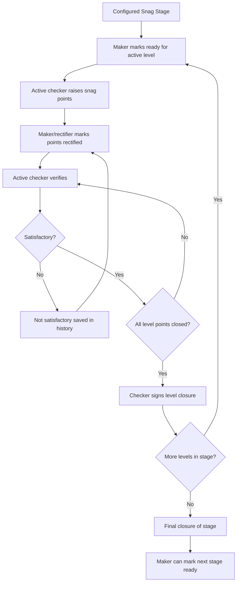

# Snag De-snag Workflow

[Back to Index](../README.md) | Related: [Quality Snag De-snag](../02-modules/quality-snag-desnag.md)

## Source Code

- Backend: `backend/src/snag`
- Frontend: `frontend/src/views/quality/SnagManagementPage.tsx`
- Configuration: `frontend/src/views/quality/subviews/SnagDesnagConfigPage.tsx`

## Important Rules

- Next snag stage must not start automatically.
- A stage can contain multiple verifier levels.
- Only the active checker level can raise/confirm/close that level.
- Snag points are saved with timestamp, vendor, evidence, rectification, de-snag confirmation, and not-satisfactory history.
- Admin-only reset/delete must log action details.

