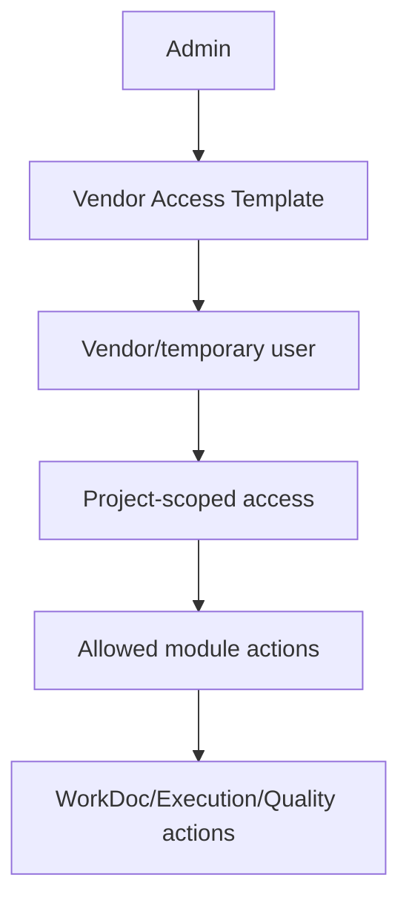

# Vendor Access Workflow

[Back to Index](../README.md) | Related: [WorkDoc And Vendors](../02-modules/workdoc-and-vendors.md), [Admin](../02-modules/admin.md)

## Source Code

- Backend: `backend/src/temp-user`, `backend/src/workdoc`, `backend/src/projects`
- Frontend: `frontend/src/pages/admin/VendorAccessTemplatesPage.tsx`

