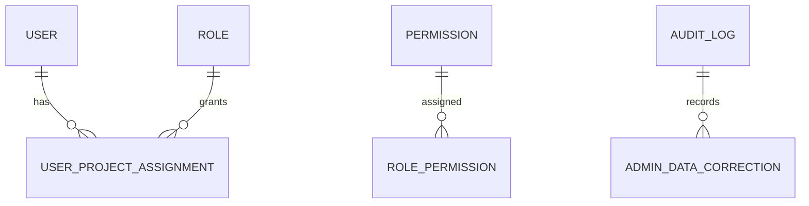

# Admin Permission Entities

[Back to Index](../README.md)

Code paths: `backend/src/users`, `backend/src/roles`, `backend/src/permissions`, `backend/src/projects`, `backend/src/audit`, `backend/src/admin-data`.

