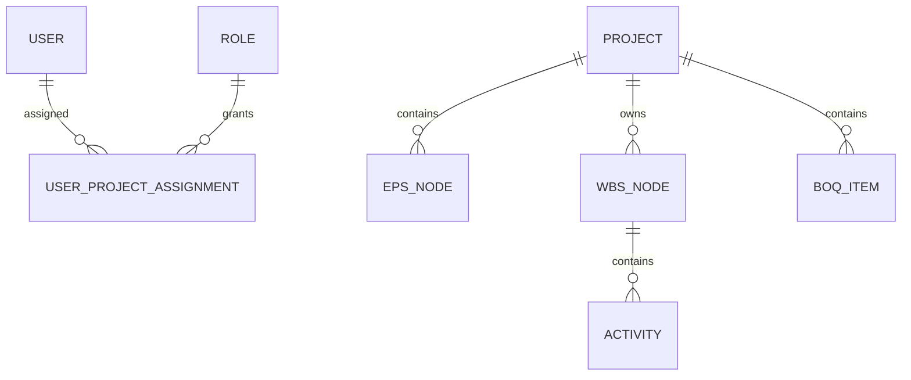

# Core Entities

[Back to Index](../README.md)

```mermaid
erDiagram
    USER ||--o{ USER_PROJECT_ASSIGNMENT : assigned
    ROLE ||--o{ USER_PROJECT_ASSIGNMENT : grants
    PROJECT ||--o{ EPS_NODE : contains
    PROJECT ||--o{ WBS_NODE : owns
    WBS_NODE ||--o{ ACTIVITY : contains
    PROJECT ||--o{ BOQ_ITEM : contains
```

Code paths: `backend/src/users`, `backend/src/roles`, `backend/src/projects`, `backend/src/eps`, `backend/src/wbs`, `backend/src/boq`.

