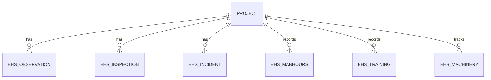

# EHS Entities

[Back to Index](../README.md)

```mermaid
erDiagram
    PROJECT ||--o{ EHS_OBSERVATION : has
    PROJECT ||--o{ EHS_INSPECTION : has
    PROJECT ||--o{ EHS_INCIDENT : has
    PROJECT ||--o{ EHS_MANHOURS : records
    PROJECT ||--o{ EHS_TRAINING : records
    PROJECT ||--o{ EHS_MACHINERY : tracks
```

Code path: `backend/src/ehs/entities`.

