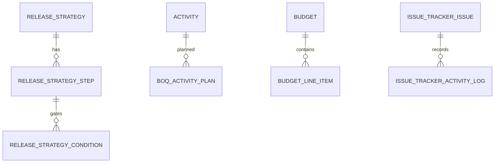

# Planning Entities

[Back to Index](../README.md)

```mermaid
erDiagram
    RELEASE_STRATEGY ||--o{ RELEASE_STRATEGY_STEP : has
    RELEASE_STRATEGY_STEP ||--o{ RELEASE_STRATEGY_CONDITION : gates
    ACTIVITY ||--o{ BOQ_ACTIVITY_PLAN : planned
    BUDGET ||--o{ BUDGET_LINE_ITEM : contains
    ISSUE_TRACKER_ISSUE ||--o{ ISSUE_TRACKER_ACTIVITY_LOG : records
```

Code paths: `backend/src/planning/entities`, `backend/src/wbs/entities`.

