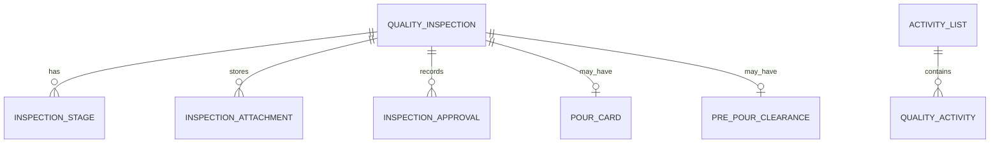

# Quality Entities

[Back to Index](../README.md)

```mermaid
erDiagram
    QUALITY_INSPECTION ||--o{ INSPECTION_STAGE : has
    QUALITY_INSPECTION ||--o{ INSPECTION_ATTACHMENT : stores
    QUALITY_INSPECTION ||--o{ INSPECTION_APPROVAL : records
    QUALITY_INSPECTION ||--o| POUR_CARD : may_have
    QUALITY_INSPECTION ||--o| PRE_POUR_CLEARANCE : may_have
    ACTIVITY_LIST ||--o{ QUALITY_ACTIVITY : contains
```

Code path: `backend/src/quality/entities`.

