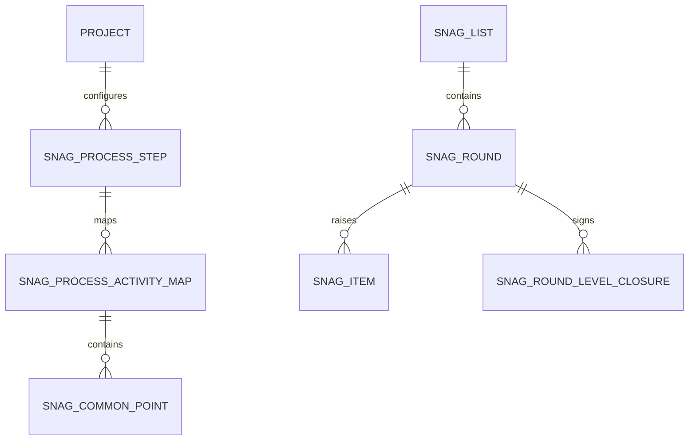

# Snag Entities

[Back to Index](../README.md)

Code path: `backend/src/snag/entities`.

Important entity rules:

- Snag list belongs to a unit and stage.
- Snag round tracks stage cycle and active verifier level.
- Snag item belongs to the verifier level that raised it.
- Closure record preserves level sign-off identity.
- Not-satisfactory history is retained for analysis.

