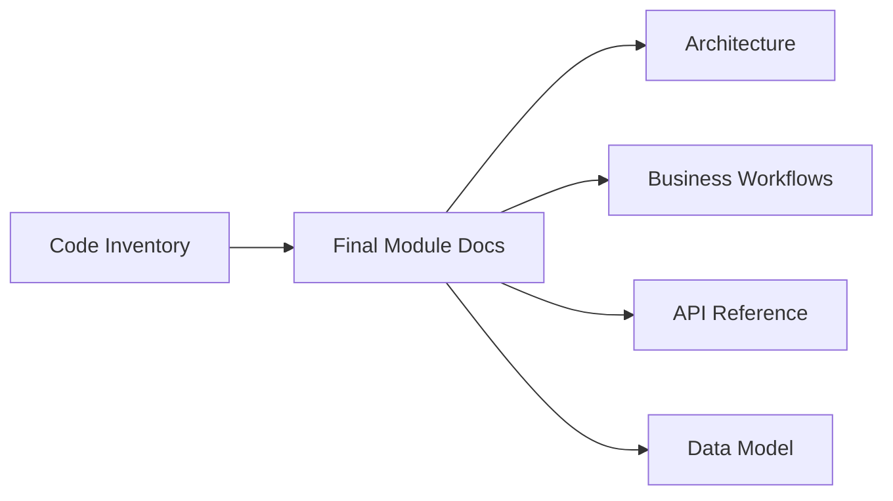

# SETU Code Inventory Index

[Back to Main Documentation](../README.md)

This section consolidates source-level inventory material from the previous root `Final Documentation` folder. It is retained as developer reference and is secondary to the approved module documentation under `../02-modules`.

## Main Inventory

| Document | Purpose |
| --- | --- |
| [Function And Class Inventory](code-inventory.md) | Generated source-level function/class inventory. |
| [Completion Note](completion-note.md) | Notes from the previous inventory generation pass. |

## Module Inventory

| Area | Documents |
| --- | --- |
| Foundation | [Auth](modules/auth.md), [Users](modules/users.md), [Roles](modules/roles.md), [Permissions](modules/permissions.md), [Projects](modules/projects.md), [App Config](modules/app-config.md), [Audit](modules/audit.md), [Notifications](modules/notifications.md), [Sync](modules/sync.md), [Common Shared Services](modules/common-shared-services.md) |
| Planning | [WBS](modules/wbs.md), [Design](modules/design.md), [BOQ](modules/boq.md), [Resources](modules/resources.md), [Planning](modules/planning.md), [Micro Schedule](modules/micro-schedule.md), [Milestones](modules/milestones.md), [Release Strategy](modules/release-strategy.md), [Template Builder](modules/template-builder.md) |
| Execution | [Execution](modules/execution.md), [Progress](modules/progress.md), [Work Documents](modules/work-documents.md), [Labor](modules/labor.md), [Dashboard](modules/dashboard.md), [Customer Milestones](modules/customer-milestones.md) |
| Control | [Quality](modules/quality.md), [Snag](modules/snag.md), [EHS](modules/ehs.md), [Issue Tracker](modules/issue-tracker.md), [Cost And Budget](modules/cost-budget.md) |
| Analytics | [Executive Dashboard](modules/executive-dashboard.md), [Dashboard Builder](modules/dashboard-builder.md), [AI Insights](modules/ai-insights.md) |
| Administration And Extensibility | [Admin Data](modules/admin-data.md), [Custom Tracker](modules/custom-tracker.md), [Table View](modules/table-view.md), [Plugins SDK](modules/plugins-sdk.md), [Temporary Users](modules/temporary-users.md) |

## Relationship To Final Module Docs

