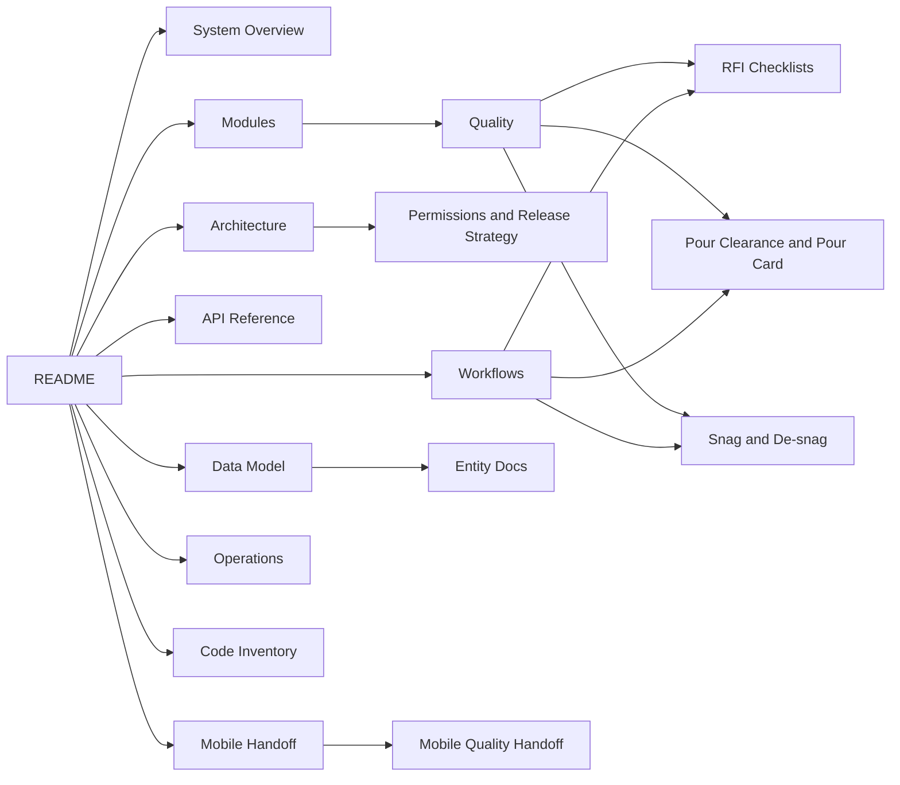

# SETU Final Documentation

Status: Code-referenced draft  
Last updated: 2026-08-07  
Audience: Product owners, backend developers, web developers, mobile developers, QA, implementation, and operations

This folder is the final navigation point for SETU system documentation. Each page links to related modules and uses code paths from the current repository so future development agents can understand the system without guessing.

## Start Here

| Document | Purpose |
| --- | --- |
| [System Overview](00-system-overview.md) | Business aim, product scope, users, and end-to-end operating model. |
| [System Context](01-architecture/system-context.md) | Application surfaces and high-level system relationships. |
| [Backend Architecture](01-architecture/backend-architecture.md) | NestJS module structure, controllers, services, entities, and migrations. |
| [Frontend Architecture](01-architecture/frontend-architecture.md) | React/Vite screens, service clients, navigation, and permission gates. |
| [Database Architecture](01-architecture/database-architecture.md) | TypeORM, PostgreSQL, migrations, and entity ownership. |
| [Permissions And Release Strategy](01-architecture/permissions-and-release-strategy.md) | Access control, workflow levels, maker/checker logic, and approval governance. |
| [Reporting And PDF Architecture](01-architecture/reporting-and-pdf-architecture.md) | Core app report and PDF generation, including RFI, pour card, snag, WIP, and signatures. |
| [Deployment And Backup](01-architecture/deployment-and-backup.md) | Docker Compose server model and database backup approach. |

## Module Documentation

| Module | Documentation |
| --- | --- |
| Admin | [Admin](02-modules/admin.md) |
| Projects and EPS | [Projects And EPS](02-modules/projects-and-eps.md) |
| WBS and Planning | [WBS And Planning](02-modules/wbs-and-planning.md) |
| BOQ and Scope | [BOQ And Scope](02-modules/boq-and-scope.md) |
| Planning and Schedule | [Planning And Schedule](02-modules/planning-and-schedule.md) |
| Site Execution | [Site Execution](02-modules/site-execution.md) |
| Progress | [Progress](02-modules/progress.md) |
| Quality | [Quality](02-modules/quality.md) |
| RFI and Checklists | [Quality RFI Checklists](02-modules/quality-rfi-checklists.md) |
| Pour Clearance and Pour Card | [Quality Pour Clearance And Pour Card](02-modules/quality-pour-clearance-and-pour-card.md) |
| Snag and De-snag | [Quality Snag De-snag](02-modules/quality-snag-desnag.md) |
| EHS | [EHS](02-modules/ehs.md) |
| Design and Drawings | [Design And Drawings](02-modules/design-and-drawings.md) |
| WorkDoc and Vendors | [WorkDoc And Vendors](02-modules/workdoc-and-vendors.md) |
| Dashboard and Analytics | [Dashboard And Analytics](02-modules/dashboard-and-analytics.md) |
| AI Insights | [AI Insights](02-modules/ai-insights.md) |
| Mobile App Integration | [Mobile App Integration](02-modules/mobile-app-integration.md) |

## Workflow Documentation

| Workflow | Documentation |
| --- | --- |
| RFI Approval | [RFI Approval Workflow](03-workflows/rfi-approval-workflow.md) |
| Pour Clearance | [Pour Clearance Workflow](03-workflows/pour-clearance-workflow.md) |
| Pour Card | [Pour Card Workflow](03-workflows/pour-card-workflow.md) |
| Snag and De-snag | [Snag De-snag Workflow](03-workflows/snag-desnag-workflow.md) |
| EHS Inspection | [EHS Inspection Workflow](03-workflows/ehs-inspection-workflow.md) |
| Progress Update | [Progress Update Workflow](03-workflows/progress-update-workflow.md) |
| Vendor Access | [Vendor Access Workflow](03-workflows/vendor-access-workflow.md) |

## API And Data Model

| Area | Documentation |
| --- | --- |
| Admin APIs | [Admin API](04-api-reference/admin-api.md) |
| Planning APIs | [Planning API](04-api-reference/planning-api.md) |
| Quality APIs | [Quality API](04-api-reference/quality-api.md) |
| Snag APIs | [Snag API](04-api-reference/snag-api.md) |
| EHS APIs | [EHS API](04-api-reference/ehs-api.md) |
| Progress APIs | [Progress API](04-api-reference/progress-api.md) |
| WorkDoc APIs | [WorkDoc API](04-api-reference/workdoc-api.md) |
| Core Entities | [Core Entities](05-data-model/core-entities.md) |
| Quality Entities | [Quality Entities](05-data-model/quality-entities.md) |
| Snag Entities | [Snag Entities](05-data-model/snag-entities.md) |
| Planning Entities | [Planning Entities](05-data-model/planning-entities.md) |
| EHS Entities | [EHS Entities](05-data-model/ehs-entities.md) |
| Admin Permission Entities | [Admin Permission Entities](05-data-model/admin-permission-entities.md) |

## Mobile And Operations

| Document | Purpose |
| --- | --- |
| [Mobile API Contract](06-mobile-handoff/mobile-api-contract.md) | Shared API expectations for the mobile app. |
| [Mobile Quality Handoff](06-mobile-handoff/mobile-quality-handoff.md) | Quality workflows for mobile developers. |
| [Mobile Snag De-snag Handoff](06-mobile-handoff/mobile-snag-desnag-handoff.md) | Snag stage and verifier-level handoff. |
| [Mobile Pour Card Handoff](06-mobile-handoff/mobile-pour-card-handoff.md) | Pour card and pre-pour clearance handoff. |
| [Database Backup](07-operations/database-backup.md) | Backup commands and restore checks. |
| [Server Deployment](07-operations/server-deployment.md) | Docker Compose deployment flow. |
| [Troubleshooting](07-operations/troubleshooting.md) | Common production checks. |

## Code Inventory

| Document | Purpose |
| --- | --- |
| [Code Inventory Index](08-code-inventory/module-index.md) | Source-level module inventory consolidated from the previous root documentation pack. |
| [Function And Class Inventory](08-code-inventory/code-inventory.md) | Generated code inventory for backend/frontend module discovery. |

## Documentation Map

